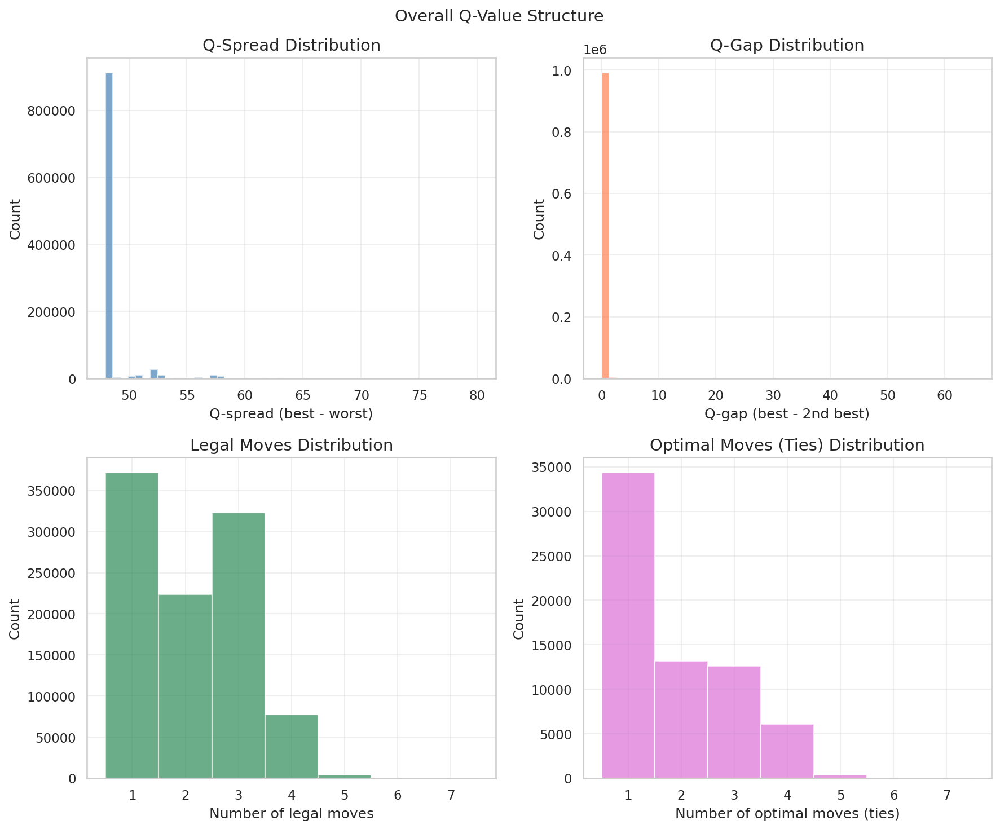
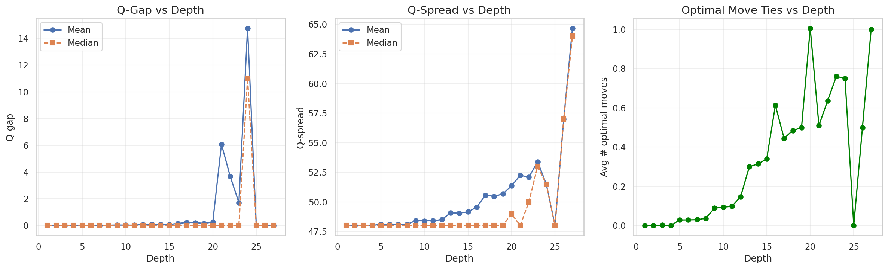

# 01: Baseline Analysis

## Context

Before analyzing structure, we established baseline statistics on V (minimax value) and Q (action values). This sets expectations for what our 97.8% accurate model is learning.

## V Distribution: What Perfect Play Looks Like

V represents the expected score differential under perfect play. Our model predicts *moves*, not V directly—but understanding V helps interpret model behavior.

**Key observations:**
- **Range**: [-42, +42], the full theoretical range
- **Shape**: Roughly normal, centered near 0
- **Concentration**: Most values in [-20, +20]

**Model relevance**: The roughly symmetric distribution means the model sees balanced training data. No systematic bias toward declaring or defending.

## Depth and Game Phase

"Depth" = dominoes remaining (28 total → 4 at endgame).

| Phase | Depth | Characteristic | Model Challenge |
|-------|-------|----------------|-----------------|
| Opening | 28-24 | High uncertainty | Many valid moves |
| Midgame | 20-12 | Count battles | Key decisions |
| Endgame | 8-4 | Determined | Obvious moves |

**Model relevance**: Our 0.15% blunder rate concentrates in midgame where positions are ambiguous. Endgame positions have clear optimal moves the model handles easily.

## Q-Value Structure: Forced Moves Are Common

Many positions have only one reasonable move:
- Following suit is often forced (no choice)
- Trump leads often force specific responses
- Late game reduces to forced sequences

**Model relevance**: The high accuracy partly reflects that many training examples have "obvious" answers. The model's real test is the ~30% of positions with multiple reasonable options.

## Q-Gap Distribution

Q-gap = difference between best and chosen action. Our model achieves mean Q-gap of 0.072 points.

To contextualize: a game is 42 points total, played across 7 tricks. A 0.072 point average error means the model loses about **0.5 points per hand** compared to perfect play—negligible in practice.

## What This Means for the Model

1. **Balanced data** — V distribution is symmetric, no class imbalance
2. **Many easy examples** — Forced moves inflate accuracy metrics
3. **Real challenge is ambiguous positions** — Where multiple moves have similar Q-values
4. **Depth matters** — Model likely learns different strategies for different game phases

The baseline confirms our training data is well-behaved. The interesting questions—*what structure enables 97.8% accuracy*—come next.

---

*Next: [02 Information Theory](02_information.md)*
