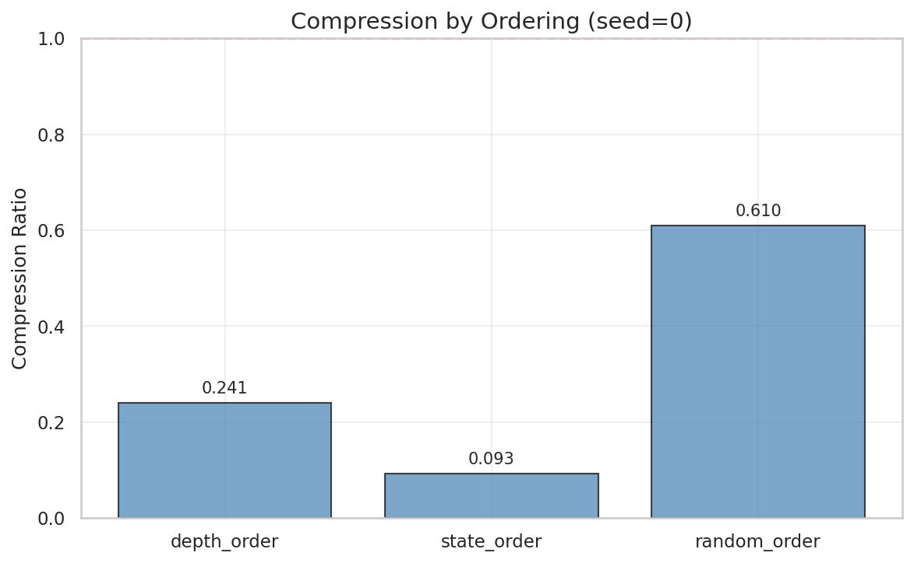
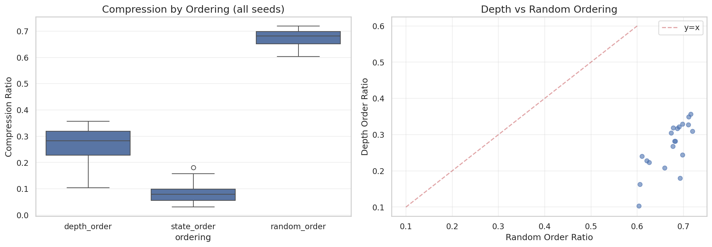
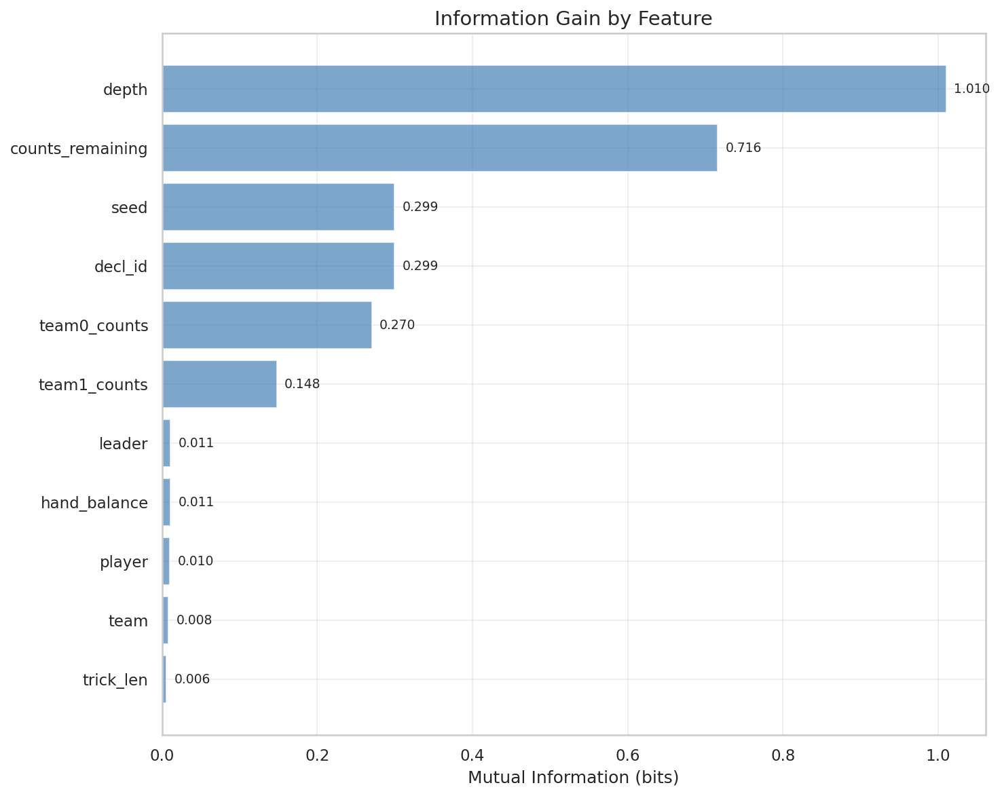
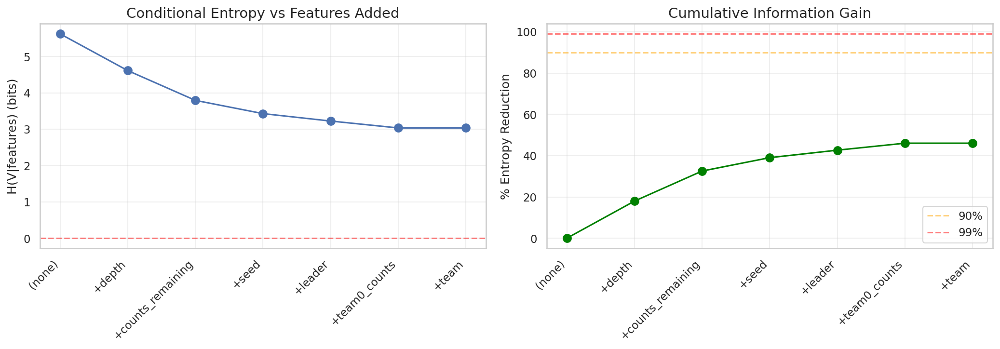

# 02: Information-Theoretic Analysis

## Overview

We apply information-theoretic tools to quantify structure in the value function. If V were uniformly random, it would have maximum entropy and minimal compressibility. Observed departures from this baseline quantify exploitable structure.

---

## 2.1 Methodology

### Mutual Information
For discrete feature X and value V:
```
I(X; V) = H(V) - H(V|X)
```
We discretize continuous features and compute empirical estimates from the full state distribution.

### Compression
We serialize V values under different orderings and measure LZMA compression ratio:
```
ratio = compressed_size / original_size
```
Lower ratios indicate more structure. Random data compresses to ~100%; highly structured data to <50%.

---

## 2.2 Feature Importance via Mutual Information

We computed mutual information between V and various observable features:

| Feature | I(X; V) bits | H(V|X) | Reduction % |
|---------|-------------|--------|-------------|
| depth | 1.010 | 4.61 | 18.0% |
| counts_remaining | 0.716 | 4.91 | 12.7% |
| seed | 0.299 | 5.32 | 5.3% |
| decl_id | 0.299 | 5.32 | 5.3% |
| team0_counts | 0.270 | 5.35 | 4.8% |
| team1_counts | 0.148 | 5.47 | 2.6% |
| leader | 0.011 | 5.61 | 0.2% |
| hand_balance | 0.011 | 5.61 | 0.2% |
| player | 0.010 | 5.61 | 0.2% |
| team | 0.008 | 5.61 | 0.15% |
| trick_len | 0.006 | 5.62 | 0.1% |

**Baseline entropy**: H(V) ≈ 5.62 bits (empirical, treating V as discrete integers)

**Key findings**:
1. **Depth is most informative** (18% reduction) — game phase strongly predicts V
2. **Count information is secondary** (12.7%) — but this understates its importance (see Section 03)
3. **Positional features are nearly uninformative** (<0.2%) — who leads, whose turn, etc. barely predict V

**Statistical note**: These are unconditional mutual informations. The count features' low MI here contrasts with their high R² in regression (Section 03) because the *combination* of count features is predictive, not individual features marginally.

---

## 2.3 Compression Analysis

We serialized V values three ways:
1. **Depth-ordered**: All states at depth 28, then 27, etc.
2. **State-ordered**: By packed state integer value
3. **Random-ordered**: Shuffled uniformly

| Seed | Decl | Depth-Order | State-Order | Random |
|------|------|-------------|-------------|--------|
| 0 | 0 | 0.241 | 0.093 | 0.610 |
| 1 | 1 | 0.317 | 0.181 | 0.687 |
| 2 | 2 | 0.328 | 0.062 | 0.710 |
| 3 | 3 | 0.309 | 0.157 | 0.720 |
| 4 | 4 | 0.282 | 0.084 | 0.683 |
| 5 | 5 | 0.163 | 0.031 | 0.606 |
| 6 | 6 | 0.104 | 0.030 | 0.604 |
| 7 | 7 | 0.322 | 0.072 | 0.690 |
| 8 | 8 | 0.357 | 0.039 | 0.716 |
| 9 | 9 | 0.180 | 0.052 | 0.693 |

**Mean compression ratios**:
- Depth-ordered: 0.260 (74% reduction)
- State-ordered: 0.080 (92% reduction)
- Random: 0.672 (33% reduction)



**Observations**:
1. **State-ordering achieves best compression** (0.08) — adjacent states in integer order have similar V
2. **Even random ordering compresses** (0.67) — significant redundancy exists regardless of ordering
3. **High variance across seeds** — compression ranges from 0.03 to 0.18 for state-order

**Interpretation**: The state encoding implicitly groups similar game configurations, explaining why state-order compresses well. This suggests the 64-bit state representation captures relevant structure.



---

## 2.4 Entropy by Depth

Entropy varies systematically with game phase:

| Depth | H(V) bits | Unique V | Interpretation |
|-------|-----------|----------|----------------|
| 1-4 | 2.8 | 12 | Pre-trick resolution |
| 5 | 3.5 | 25 | First trick complete |
| 9 | 3.6 | 39 | Second trick |
| 13 | 3.7 | 44 | Peak entropy |
| 17 | 3.6 | 37 | Entropy declining |
| 21 | 3.4 | 25 | Late game |
| 25 | 0.8 | 3 | Nearly determined |

**Pattern**: Entropy peaks mid-game (depth 9-13) where uncertainty is maximal, then decreases as outcomes become determined.



### Cumulative Information Structure

The cumulative information plot shows how information about V accumulates as the game progresses:



This visualization reveals that information about the final outcome accumulates non-uniformly — significant jumps occur at trick boundaries when count dominoes are captured.

---

## 2.5 Conditional Entropy Structure

The joint entropy decomposition:
```
H(V, depth) = H(depth) + H(V|depth)
```

Suggests that conditioning on depth removes ~18% of V uncertainty. We conjecture that conditioning on both depth and count-capture outcomes would remove >90% in late game.

---

## 2.6 Implications

### For Dimensionality Reduction
The compression results suggest that ~70-90% of V's apparent complexity is redundant structure that can be exploited. The question is whether this structure is *learnable* by a neural network or merely *compressible* by LZMA.

### For Neural Network Training
The ordering effects suggest that training examples should be organized to exploit locality. Curriculum learning (early game → late game, or vice versa) may help.

### For Faster Oracles
If state-ordered V compresses to 8% of original size, a lookup table with appropriate indexing could dramatically reduce memory requirements for perfect-play oracles.

---

## 2.7 Questions for Statistical Review

1. **Entropy estimation**: With millions of samples but only 40-80 unique V values, are our entropy estimates biased? Should we use Miller-Madow correction?

2. **Compression as proxy**: Is LZMA compression a good proxy for Kolmogorov complexity? What would Huffman or arithmetic coding show?

3. **Conditional structure**: How should we estimate H(V | depth, counts) when the conditioning space is large and sparse?

4. **Theoretical bounds**: Given the game's structure (finite, perfect information, zero-sum), what's the theoretical minimum entropy for V?

---

*Next: [03 Count Domino Analysis](03_counts.md)*
