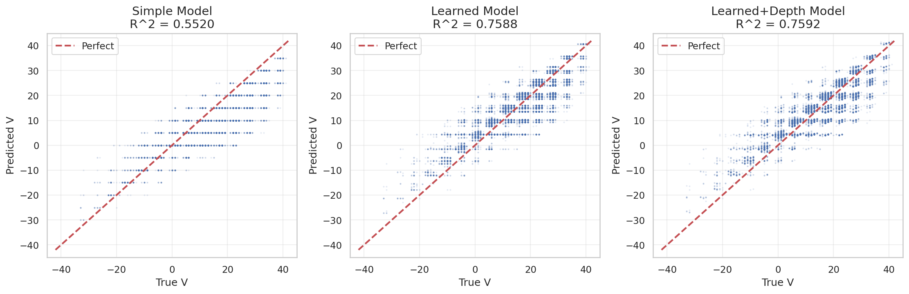
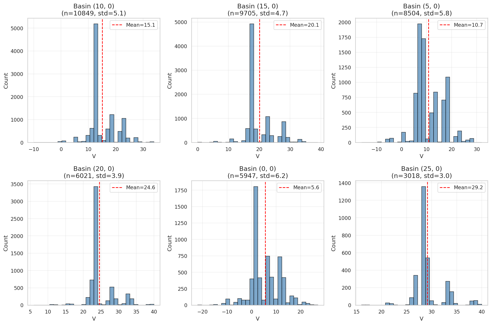
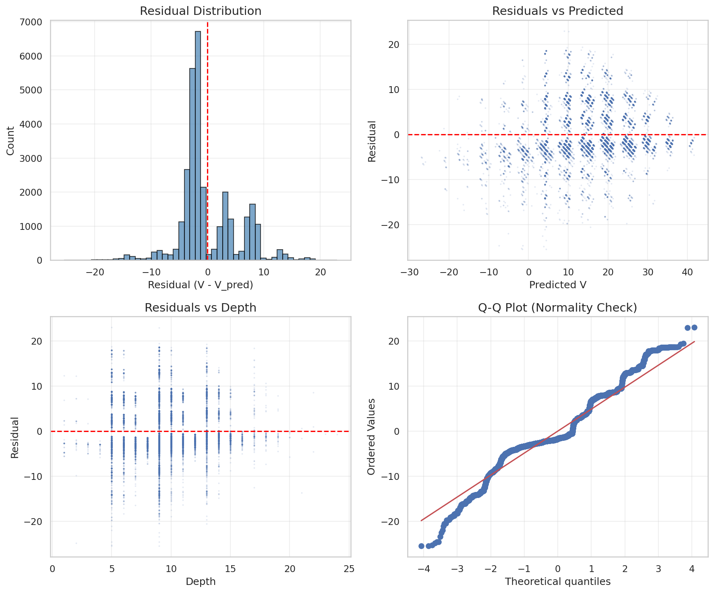
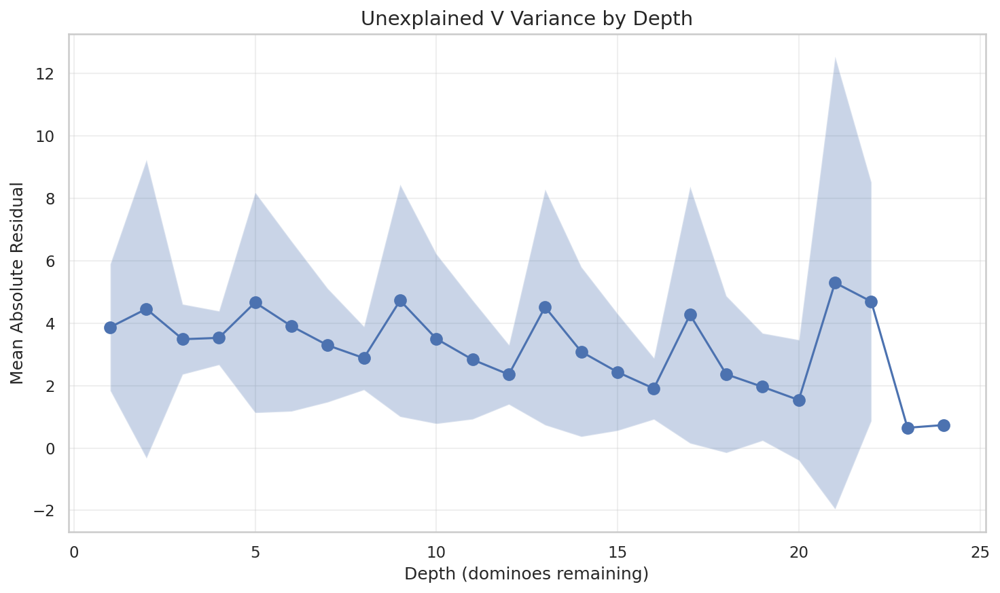

# 03: Count Domino Analysis

## Context

This is the most important section. Count dominoes explain **76% of game value variance**—and our model explicitly encodes them. This section explains why our 97.8% accuracy is possible.

## The Five Count Dominoes

Texas 42 has five "count" dominoes worth points:

| Domino | Points | Nickname |
|--------|--------|----------|
| 5-5 | 10 | Big Ten |
| 0-5 | 5 | Five-Blank |
| 1-4 | 5 | Fifteen |
| 2-3 | 5 | Twenty-Three |
| 3-3 | 5 | Double-Three |

Total: **35 points** of 42 possible. Capturing these dominoes determines 83% of points directly.

## R² = 0.76: Counts Dominate Everything

We built progressively complex models predicting V from count information:

| Model | R² | Description |
|-------|-----|-------------|
| Simple (fixed coef) | 55% | Each count worth its point value |
| Learned coefficients | 76% | Weights learned from data |
| Learned + depth | 76% | Adding depth doesn't help much |

**The finding**: Knowing which team holds which counts explains three-quarters of the outcome.

**Model relevance**: Our DominoTransformer encodes `count_value` (0/5/10) as one of 12 token features. This is probably the single most important feature for the model's success.

## Count Capture Basins

We grouped positions by their "count basin"—which counts have been captured by which team.

**Finding**: Late-game basins are extremely pure:

| Depth | Within-Basin Variance |
|-------|----------------------|
| 8 | 0.31 |
| 12 | 0.31 |
| 16 | 0.38 |

At depth 16, if you know which counts were captured, you can predict V with variance < 1. The endgame is nearly deterministic.

**Model relevance**: This explains our 0.15% blunder rate. Late-game positions fall into pure basins with obvious optimal moves. Blunders require ambiguous positions—which are rare once counts are determined.

## Residual Analysis: What Counts Don't Explain

The 24% unexplained variance comes from:

1. **Trick-taking dynamics** — *How* counts are captured, not just *whether*
2. **Trump control** — Who controls the trump suit
3. **Timing** — When to cash counts vs. when to hold them

**Model relevance**: This is what the Transformer's attention mechanism captures. Simple count ownership isn't enough—you need sequential reasoning about trick flow.

## The Trump-Heavy Hand Problem Revisited

Our known bug (t42-pa69): model plays 2-2 instead of 6-6 with seven trumps.

**Why count analysis doesn't help**: Both 2-2 and 6-6 capture the same count points (none—neither is a count domino). The difference is *reliability*:
- 6-6 always wins (highest trump)
- 2-2 might lose to higher trump

Count features don't distinguish these. The model needs to learn *robustness*, not count capture.

**Solution**: Marginalized Q-values train on multiple opponent distributions, teaching that 6-6 is universally good while 2-2 is situational.

## What This Means for the Model

| Finding | Model Implication |
|---------|-------------------|
| Counts = 76% R² | `count_value` feature is critical |
| Pure late-game basins | Explains low blunder rate |
| 24% unexplained = trick dynamics | Why attention matters |
| Counts don't cover robustness | Why marginalized training needed |

**Bottom line**: Texas 42 is largely "count poker." Our model's explicit count encoding is probably its most important architectural decision.

---

*Next: [04 Symmetry Analysis](04_symmetry.md)*
