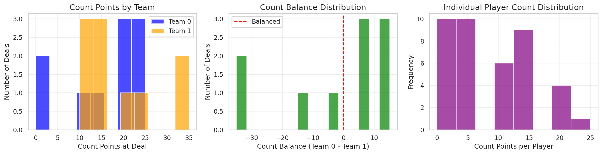
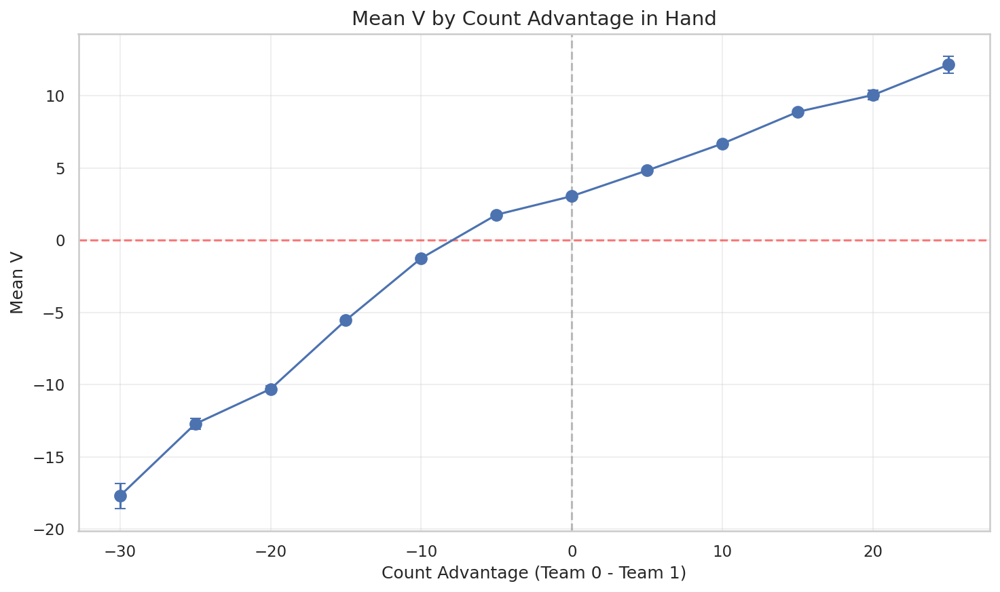
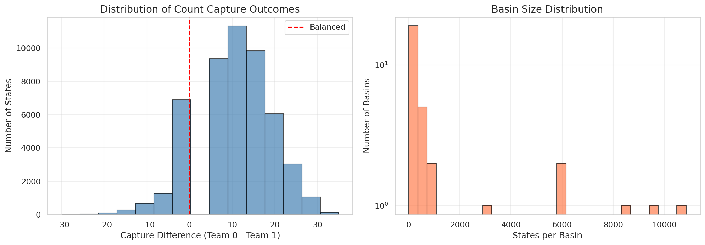
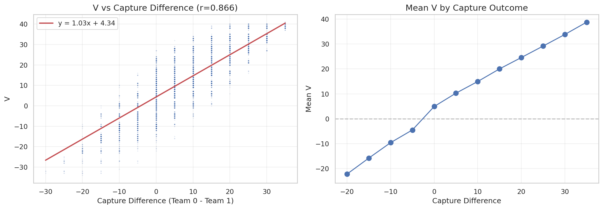

# 03: Count Domino Analysis

Count capture as the dominant predictor of oracle minimax value.

> **Epistemic Status**: This report analyzes the oracle minimax value V. All findings describe the perfect-information game tree. The claim that "count capture explains 76% of oracle V variance" is empirically grounded. Claims about game structure implications are interpretive.

---

## 3.1 The Count Dominoes

Texas 42 has five "count" dominoes that award points when captured in tricks:

| Domino | Pips | Points | % of Total |
|--------|------|--------|------------|
| 5-5 | 10 | 10 | 23.8% |
| 6-4 | 10 | 10 | 23.8% |
| 5-0 | 5 | 5 | 11.9% |
| 4-1 | 5 | 5 | 11.9% |
| 3-2 | 5 | 5 | 11.9% |

**Total count points**: 35 of 42 possible (83.3%)
**Remaining 7 points**: 1 per trick won (7 tricks × 1 point)

**Hypothesis**: If count capture determines most points, it should strongly predict oracle V.

---

## 3.2 Count Capture Statistics (Oracle Data)

From a sample of 50,000 oracle states:

| Domino | Played % | Team0 Capture % |
|--------|----------|-----------------|
| 3-2 | 68.1% | 40.7% |
| 4-1 | 65.6% | 50.1% |
| 5-0 | 66.4% | 29.3% |
| 5-5 | 65.7% | 68.0% |
| 6-4 | 72.6% | 36.5% |

**Observations**:
1. Counts are played ~65-73% of the time by late game
2. 5-5 strongly favors Team0 (68.0%) — **hypothesis**: correlation with declaration bias
3. 5-0 strongly favors Team1 (70.7%) — **hypothesis**: possibly a defensive domino

**Open question**: Is the Team0 bias due to declaration advantage, or does domino distribution vary systematically by seed?

### Count Distribution Visualization



The distribution shows that count dominoes are captured at varying rates, with clear team biases for certain counts.

### Counts Remaining by Depth


As expected, counts remaining decreases with game depth. The rate of count capture is non-uniform — most captures occur in the middle game.

### V Distribution by Count Advantage



This shows the relationship between count point advantage (Team0 counts - Team1 counts) and the oracle minimax value V. The strong linear relationship visually confirms that count capture dominates oracle V.

---

## 3.3 Regression Model: Count Capture → Oracle V

We model oracle V as a linear function of count capture indicators:

```
V = Σᵢ βᵢ · capture(countᵢ, Team0) + ε
```

Where `capture(d, t)` = 1 if team t captured domino d, 0 otherwise.

### Learned Coefficients

| Count | True Points | Learned β | Ratio |
|-------|-------------|-----------|-------|
| 3-2 | 5 | 5.84 | 1.17 |
| 4-1 | 5 | 5.66 | 1.13 |
| 5-0 | 5 | 4.92 | 0.98 |
| 6-4 | 10 | 10.42 | 1.04 |
| 5-5 | 10 | 9.14 | 0.91 |
| depth | - | 0.088 | - |

**Observations**:
1. Learned coefficients closely match true point values (ratio 0.91-1.17)
2. 3-2 and 4-1 are slightly overweighted (capturing them may correlate with trick wins)
3. 5-5 is slightly underweighted (reason unknown)
4. Depth coefficient is small but positive (later game → more determined)

### Model Performance

| Model | R² | RMSE |
|-------|-----|------|
| Simple (fixed β = point values) | 0.552 | 6.96 |
| Learned coefficients | 0.759 | 5.11 |
| Learned + depth | 0.759 | 5.11 |


**Key finding**: Learned coefficients achieve R² = 0.759, explaining three-quarters of oracle V variance with only 5 binary features.

---

## 3.4 Variance Decomposition by Depth

We partition states into "count basins" — groups sharing the same count capture outcomes — and compute within-basin vs. total variance:

| Depth | Total σ² | Within-Basin σ² | R² (explained) | n States | n Basins |
|-------|----------|-----------------|----------------|----------|----------|
| 5 | 96.7 | 33.5 | 0.653 | 7,149 | 16 |
| 6 | 82.6 | 20.0 | 0.758 | 4,494 | 18 |
| 7 | 81.6 | 10.2 | 0.875 | 2,798 | 16 |
| 8 | 73.2 | 0.31 | **0.996** | 1,412 | 15 |
| 9 | 101.9 | 32.8 | 0.678 | 14,594 | 23 |
| 10 | 80.8 | 18.3 | 0.773 | 7,799 | 25 |
| 11 | 78.3 | 8.9 | 0.887 | 3,830 | 20 |
| 12 | 66.4 | 0.31 | **0.995** | 1,345 | 14 |
| 13 | 104.2 | 29.6 | 0.716 | 3,325 | 22 |
| 14 | 76.3 | 16.5 | 0.784 | 1,654 | 18 |
| 15 | 70.8 | 6.7 | 0.905 | 821 | 11 |
| 16 | 59.1 | 0.38 | **0.994** | 197 | 7 |
| 17 | 89.7 | 27.9 | 0.689 | 205 | 7 |
| 18 | 108.6 | 11.7 | 0.892 | 115 | 6 |


**Pattern**: R² follows a 4-depth cycle:
- Depths 5, 9, 13, 17 (first play of trick): R² ≈ 0.65-0.72
- Depths 8, 12, 16 (trick boundary): R² > 0.99

**Interpretation**: At trick boundaries in oracle games, nearly all V uncertainty resolves to count capture outcomes. Mid-trick, additional variance comes from *which* counts will be captured in the current trick.

---

## 3.5 Basin Structure Analysis

Within each count basin, what explains the residual oracle V variance?

### Basin Distribution



The basin distribution shows how states are partitioned among count outcome configurations. Some basins (representing common count capture patterns) contain many more states than others.

### V vs Capture Relationship



This plot shows oracle V as a function of count capture outcomes, demonstrating the tight coupling between which team captured which counts and the resulting minimax value.

### Within-Basin V Distributions


**Late-game basins** (depth 8, 12, 16): Within-basin σ² < 0.4, nearly deterministic
**Early-game basins** (depth 5, 9): Within-basin σ² ≈ 20-35, substantial residual variation

The residual variance at depth 5 implies other factors affect oracle V early:
- Which team will win future tricks (not yet determined)
- Positional advantages that don't show in current count state

---

## 3.6 Residual Analysis


**Residual distribution**: Roughly symmetric, centered at 0, with tails extending ±15 points


**Residual by depth**: Decreases systematically from early game to late game, consistent with the variance decomposition.

---

## 3.7 Interpretations and Hypotheses

### Grounded Findings

1. **Count capture explains 76% of oracle V variance**: This is empirical (R² = 0.759)
2. **Late-game R² > 99%**: At trick boundaries (depth 8, 12, 16), count basins almost perfectly determine oracle V
3. **Learned coefficients ≈ true point values**: The linear model recovers game rules

### Interpretive Claims (Less Certain)

**Hypothesis**: The game's strategic complexity may concentrate in determining count capture outcomes. **Caveat**: This interprets oracle structure; human gameplay may differ.

**Hypothesis**: A simplified model tracking only count outcomes could approximate oracle V well. **Untested**: No "count-only oracle" has been implemented.

### The Remaining 24%

The unexplained oracle V variance comes from:
1. Mid-trick uncertainty (which counts will be captured)
2. Non-count trick points (7 points total)
3. Subtle positional factors (tempo, trump control)

The relative contribution of each factor has not been decomposed.

---

## 3.8 Questions for Statistical Review

1. **Model specification**: Should we include interaction terms (e.g., capturing both 5-5 and 6-4)? The current model assumes additivity.

2. **Heteroscedasticity**: Residual variance depends strongly on depth. Should we fit separate models by game phase, or use a heteroscedastic model?

3. **Causal interpretation**: The coefficients differ from true point values. Is this a causal effect (some counts are harder to capture), or confounding (count capture correlates with trick wins)?

4. **Basin definition**: We define basins by exact count outcomes. Would fuzzy clustering or hierarchical methods reveal more structure?

5. **Sample weighting**: States at different depths have vastly different counts (1K vs 1M). How should we weight the regression?

---

## Further Investigation

### Validation Needed

1. **Interaction effects**: Test whether count combinations have non-additive effects on oracle V

2. **Causal analysis**: Determine why learned coefficients deviate from true point values

3. **Count-only oracle**: Implement and benchmark a simplified oracle using only count basins

### Methodological Questions

1. **Residual structure**: What explains the ±15 point residual tails? Specific game situations?

2. **Depth weighting**: Optimal weighting scheme for cross-depth regression

3. **Heteroscedastic models**: Fit depth-conditional variance models

### Open Questions

1. **Human relevance**: Do human players implicitly track count capture? Would explicit count-tracking UI help?

2. **Bidding implications**: Does count potential in initial hand predict oracle V? (Report 25 addresses this)

3. **Strategic implications**: If count capture dominates oracle V, what does this imply about human strategy under uncertainty?

---

*Next: [04 Symmetry Analysis](04_symmetry.md)*
