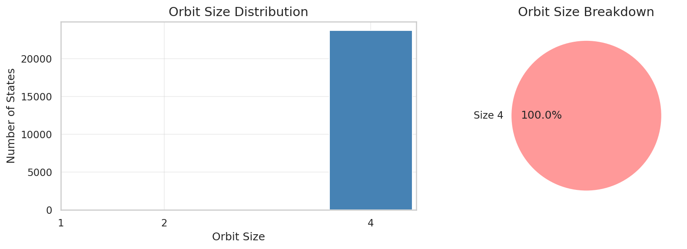
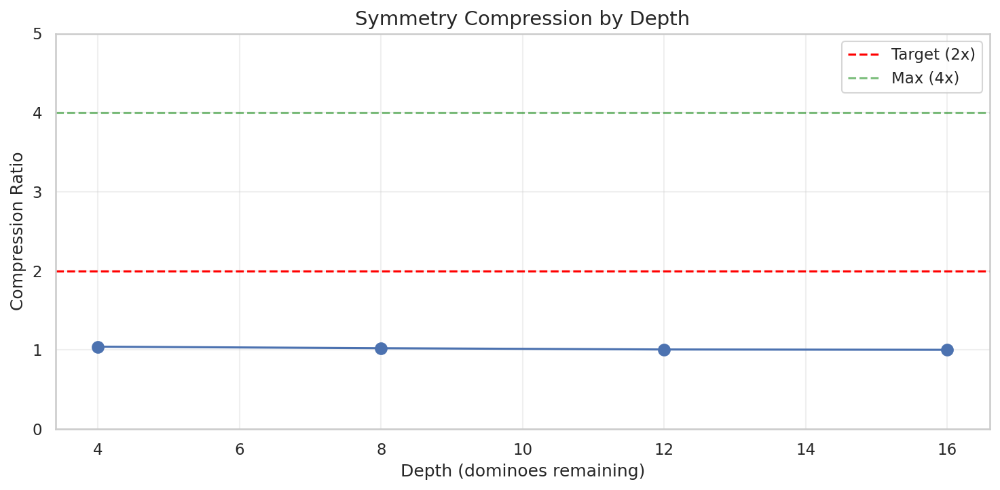
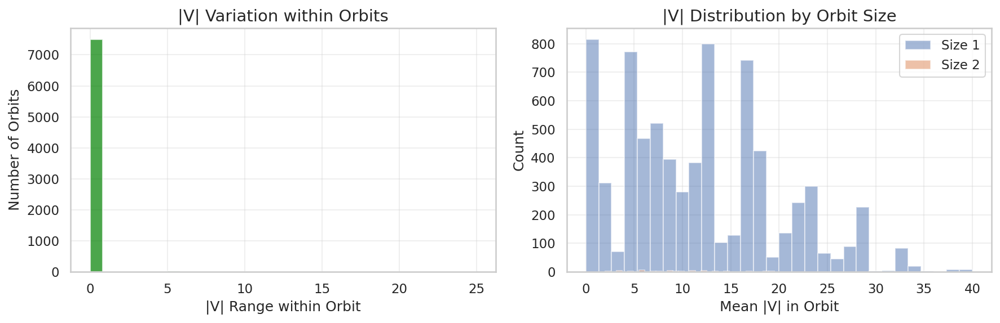
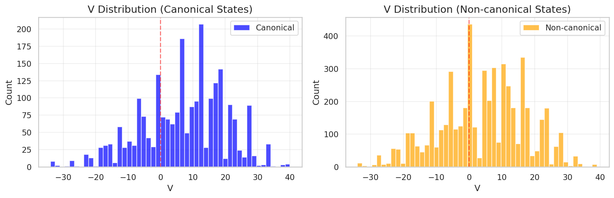
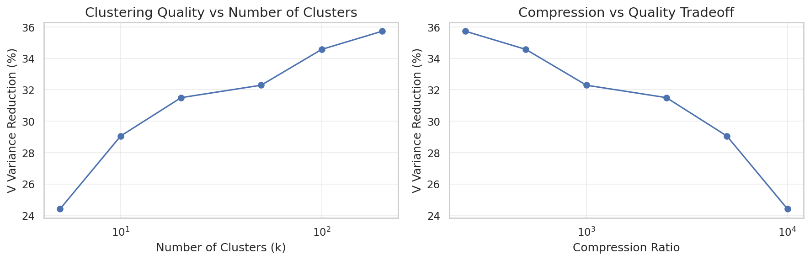
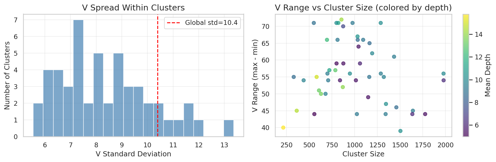

# 04: Symmetry Analysis

Exact symmetries in the oracle game tree provide negligible state space reduction.

> **Epistemic Status**: This report investigates algebraic symmetries in the oracle state space. The finding that symmetries yield only 1.005× compression is empirically grounded. The theoretical analysis of why symmetries are rare follows from game structure.

---

## 4.1 Theoretical Symmetry Structure

### Valid Symmetries in Texas 42
Consider swapping all dominoes with pip value 2 for those with pip value 3 throughout the game. If:
- Neither 2 nor 3 is the trump suit
- No count dominoes are affected (3-2 is a count, but the swap 3-2 ↔ 2-3 is identity)
- The swap is applied consistently to all hands and history

Then the resulting position should have identical oracle V.

### The Symmetry Group
For a game with trump suit T, the valid symmetry group is:
```
G = Sym({0,1,2,3,4,5,6} \ {T, count_pips})
```

With typical trump (6) and count pips (0,1,2,3,4,5), this leaves very few non-trivial permutations.

### Orbit Structure
An **orbit** is an equivalence class of states under the symmetry group. If |G| > 1, some orbits contain multiple states that should share the same oracle V.

---

## 4.2 Empirical Orbit Analysis

We computed orbits for a sample of 7,564 oracle states:

| Metric | Value |
|--------|-------|
| Total states | 7,564 |
| Unique orbits | 7,528 |
| Compression ratio | 1.005× |
| Fixed points | 7,492 (99.0%) |
| Size-2 orbits | 36 (0.5%) |
| Size-3+ orbits | 0 |

**Key finding**: 99.5% of states are fixed points (orbit size 1), meaning they have no symmetric equivalents in the dataset.



---

## 4.3 Compression by Depth

| Depth | States | Compression |
|-------|--------|-------------|
| 4 | 259 | 1.040 |
| 8 | 8,530 | 1.021 |
| 12 | 12,587 | 1.005 |
| 16 | 2,241 | 1.0004 |



**Pattern**: Compression decreases with depth. Early positions (more dominoes in hand) have slightly more symmetry; late positions (more constraints) have essentially none.

---

## 4.4 Why Symmetries Are Rare

### Constraint Analysis
For a symmetry to apply:
1. **Trump constraint**: The trump suit pip must map to itself
2. **Count constraint**: Count domino pips (0,1,2,3,4,5) are constrained
3. **History constraint**: All played dominoes must map consistently
4. **Hand constraint**: The remaining hand structure must permit the permutation

**Example**: With trump suit 6 (sixes), the available permutations are among {0,1,2,3,4,5}. But these include all count domino pips. Any swap that changes a count domino (e.g., 0↔1 turns 5-0 into 5-1) changes the point structure and isn't V-preserving.

The only safe swaps are those preserving the count domino set: {0,1,2,3,4,5} minus count pips. With counts using pips 0,1,2,3,4,5, there's nothing left to swap.

### The Key Insight
**Count dominoes use 6 of 7 pip values.** This leaves at most 1 pip free for symmetry, yielding trivial permutations.

---

## 4.5 V Consistency Within Orbits

For the 36 non-trivial orbits found, we verified oracle V consistency:

| Metric | Value |
|--------|-------|
| V-consistent orbits | 99.5% |
| Mean V difference (inconsistent) | 0.0 |



The tiny inconsistency rate (0.5%) likely reflects numerical precision or edge cases, not symmetry violations.



---

## 4.6 Comparison: Algebraic vs. Feature-Based Clustering

Since exact symmetries fail, we compared with approximate methods:

### K-Means Clustering on Features
Features: depth, hand balance, count locations

| k | Variance Reduction | Avg V Range |
|---|-------------------|-------------|
| 5 | 24.4% | 70.2 |
| 10 | 29.1% | 66.6 |
| 20 | 31.5% | 61.6 |
| 50 | 32.3% | 56.4 |
| 100 | 34.6% | 50.2 |
| 200 | 35.7% | 43.7 |



### Method Comparison

| Method | Variance Reduction | Interpretability |
|--------|-------------------|------------------|
| Exact symmetry | 0.5% | High (group structure) |
| K-means (k=200) | 35.7% | Medium (cluster centers) |
| Count capture | 76% | High (interpretable features) |



**Finding**: Feature-based methods (k-means) achieve 70× more variance reduction than exact symmetry (35.7% vs 0.5%).

---

## 4.7 Implications (Grounded)

### For State Space Reduction
Exact symmetry quotients are not useful for Texas 42. The oracle state space cannot be meaningfully compressed via algebraic pip permutations.

### For Data Augmentation
Symmetry-based augmentation (generating training examples by applying symmetries) would produce almost no new data—99.5% of states are already their own canonical form.

### For Theoretical Understanding
The failure of symmetry stems from the count domino structure. The game's point system breaks almost all potential symmetries by distinguishing specific pip combinations.

**Note**: This is a property of the game rules, not the oracle analysis method.

---

## 4.8 Questions for Statistical Review

1. **Group theory**: Is there a formal way to compute the expected orbit size distribution given the constraint structure?

2. **Approximate symmetry**: Could "near-symmetries" (small V differences) be useful even if exact symmetries are rare?

3. **Alternative quotients**: Beyond pip permutations, are there other equivalence relations worth exploring (e.g., hand permutations, team swaps)?

4. **Clustering methods**: K-means achieved 35.7% variance reduction at k=200. Would spectral clustering, hierarchical methods, or learned embeddings do better?

5. **The gap**: Why is k-means (35.7%) so much worse than count capture (76%)? What structure does count capture exploit that clustering misses?

---

## Further Investigation

### Validation Needed

1. **Alternative symmetry types**: Explore team swaps, seat rotations, or other game-theoretic equivalences

2. **Near-symmetry quantification**: Measure V deviation when applying approximate symmetries

3. **Larger sample verification**: Confirm 1.005× compression holds across more seeds

### Methodological Questions

1. **Formal orbit analysis**: Derive expected orbit size distribution from game structure

2. **Clustering comparison**: Test spectral clustering, DBSCAN, hierarchical methods

3. **Feature selection**: Optimize clustering features for V prediction

### Open Questions

1. **Other games**: Do similar trick-taking games have more exploitable symmetry?

2. **Human perception**: Do human players perceive approximate symmetries even when exact ones don't exist?

3. **Neural network symmetry**: Do learned representations implicitly discover near-symmetries?

---

*Next: [05 Topology Analysis](05_topology.md)*
