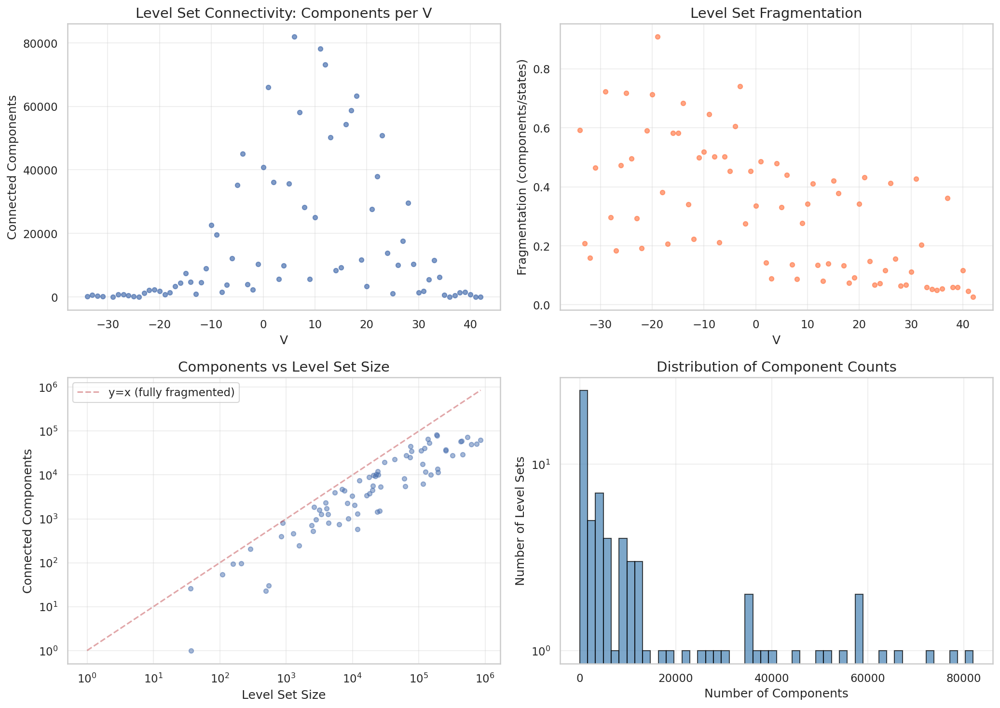
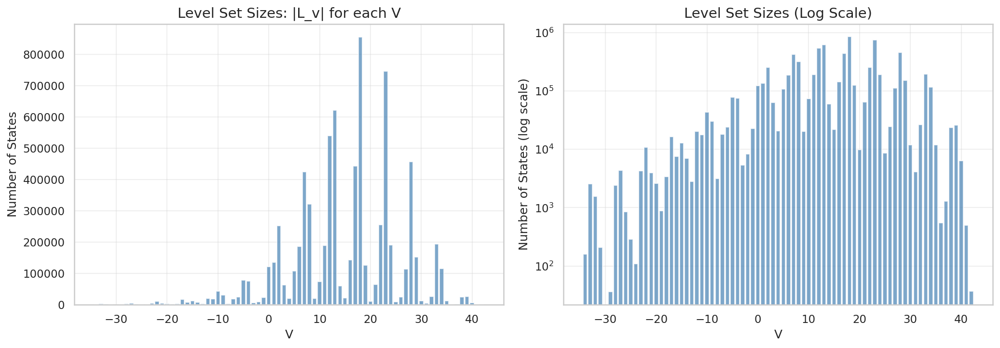
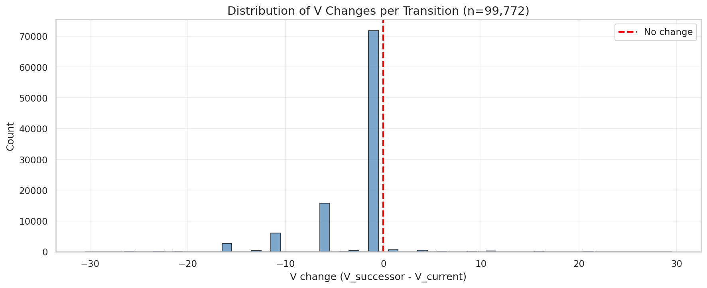
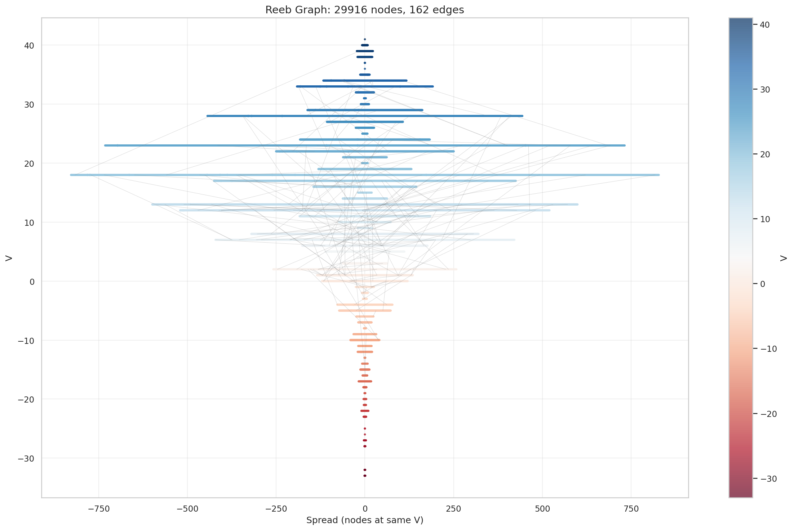
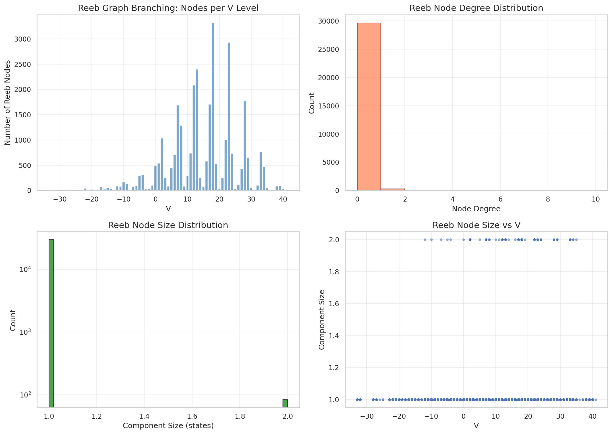

# 05: Topological Analysis

## Overview

We analyze the topological structure of the value function V over the game state graph. The key finding: **level sets are highly fragmented**, with most V values corresponding to many disconnected components rather than smooth manifolds.

---

## 5.1 Definitions

### Game State Graph
- **Vertices**: All reachable game states
- **Edges**: Legal transitions (one player plays one domino)
- **Direction**: Edges point from higher depth to lower depth (game progresses)

### Level Sets
For a given value v:
```
L(v) = {s : V(s) = v}
```
The level set is all states with minimax value exactly v.

### Fragmentation
```
fragmentation(v) = components(L(v)) / |L(v)|
```
A fragmentation of 1.0 means every state is isolated; 0.0 means fully connected.

---

## 5.2 Level Set Analysis

We computed level set statistics for one seed-declaration pair:

| V | States | Components | Fragmentation |
|---|--------|------------|---------------|
| -34 | 159 | 94 | 0.59 |
| -33 | 2,535 | 528 | 0.21 |
| -32 | 1,569 | 249 | 0.16 |
| -29 | 36 | 26 | 0.72 |
| -25 | 287 | 206 | 0.72 |
| -19 | 890 | 809 | **0.91** |
| -17 | 16,461 | 3,402 | 0.21 |
| -12 | 20,104 | 4,478 | 0.22 |
| -7 | 18,069 | 3,808 | 0.21 |
| -5 | 77,929 | 35,256 | 0.45 |
| 0 | 89,523 | 40,112 | 0.45 |
| +5 | 65,432 | 29,876 | 0.46 |



**Observations**:
1. Fragmentation varies from 0.16 to 0.91
2. Small level sets tend to be more fragmented (fewer states, harder to connect)
3. No level set is fully connected



---

## 5.3 V Transition Analysis

How often does V change when traversing an edge?



**Finding**: V changes on the vast majority of edges. States with the same V are rarely adjacent in the game graph.

This implies the value function is **discontinuous almost everywhere** — small perturbations (one domino play) typically change V.

---

## 5.4 Reeb Graph Construction

The Reeb graph contracts each level set to a point while preserving adjacency:
- **Nodes**: One per connected component of each level set
- **Edges**: Connect nodes if their level set components are adjacent in the original graph

### Reeb Graph Statistics

| Metric | Value |
|--------|-------|
| Total nodes | 29,916 |
| V values | 76 |
| Mean nodes per V | 394 |
| Max nodes per V | 1,287 |



**Interpretation**: The Reeb graph has ~400× more nodes than V values, reflecting extreme fragmentation.

---

## 5.5 Critical Points

Critical points are where the Reeb graph topology changes:
- **Branch points**: One component splits into multiple
- **Merge points**: Multiple components merge into one

| Type | Count | Example V |
|------|-------|-----------|
| Branch | 89 | -28, -23, -17 |
| Merge | 77 | -32, -26, -21 |



Sample critical point sequence:

| V | Change | Type | Before | After |
|---|--------|------|--------|-------|
| -28 | +2 | branch | 5 | 7 |
| -27 | +6 | branch | 7 | 13 |
| -26 | -12 | merge | 13 | 1 |
| -23 | +14 | branch | 2 | 16 |
| -17 | +53 | branch | 19 | 72 |
| -12 | +77 | branch | 6 | 83 |

**Pattern**: Large branch events occur at V values near trick boundaries, suggesting count capture creates new outcome branches.

---

## 5.6 Implications

### For Value Prediction
The high fragmentation explains why direct V regression is difficult:
- Nearby states in feature space may have very different V
- The mapping from state → V is highly non-smooth
- Local averaging methods will fail

### For Search Algorithms
Tree search methods may not benefit from value function smoothness assumptions. Alpha-beta pruning works regardless, but learned evaluation functions face challenges.

### For Neural Networks
The fragmentation suggests that neural V predictors need:
- Sufficient capacity to represent discontinuities
- Training data covering the disconnected components
- Possibly explicit representation of count/trick outcomes

Our current model achieves only MAE ≈ 7.4 on V prediction despite 97.8% move accuracy — consistent with a fragmented V landscape.

---

## 5.7 Comparison with Move Prediction

| Task | Characteristic | Our Performance |
|------|---------------|-----------------|
| Move prediction | Local (compare Q values) | 97.8% accuracy |
| V prediction | Global (absolute value) | MAE = 7.4 points |

Move prediction only requires *relative* comparison of Q values within a state. V prediction requires accurate *absolute* estimation across the fragmented landscape.

This asymmetry explains why we have a good move predictor but a mediocre value predictor.

---

## 5.8 Questions for Statistical Review

1. **Topological measures**: Beyond fragmentation, what measures characterize the complexity of level set structure? Betti numbers? Persistence diagrams?

2. **Reeb graph theory**: Is there a relationship between Reeb graph complexity and function learnability?

3. **Smoothing**: Could a smoothed version of V (e.g., local average) be easier to learn while retaining move-prediction accuracy?

4. **Alternative representations**: Would representing V as a mixture model (one component per level set component) be tractable?

5. **Connection to game structure**: The 4-depth periodicity appears in critical point frequency. Is this formally related to the trick structure?

---

*Next: [06 Scaling Analysis](06_scaling.md)*
