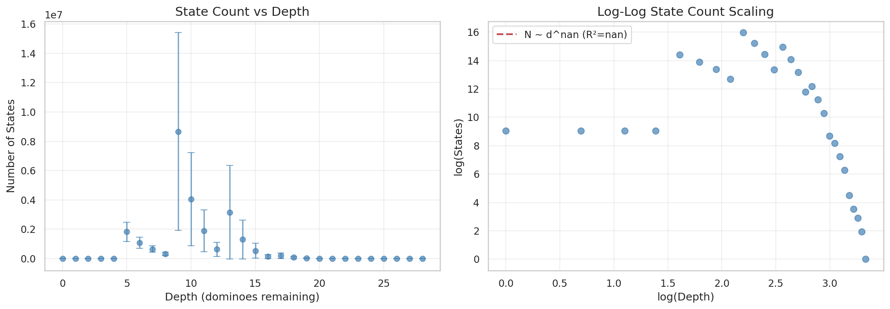
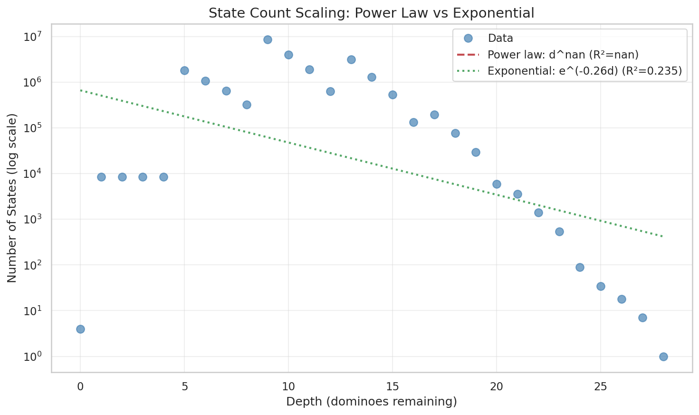
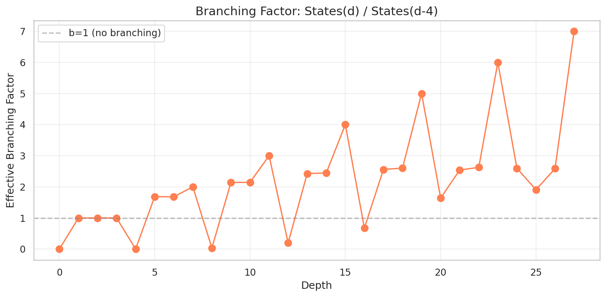
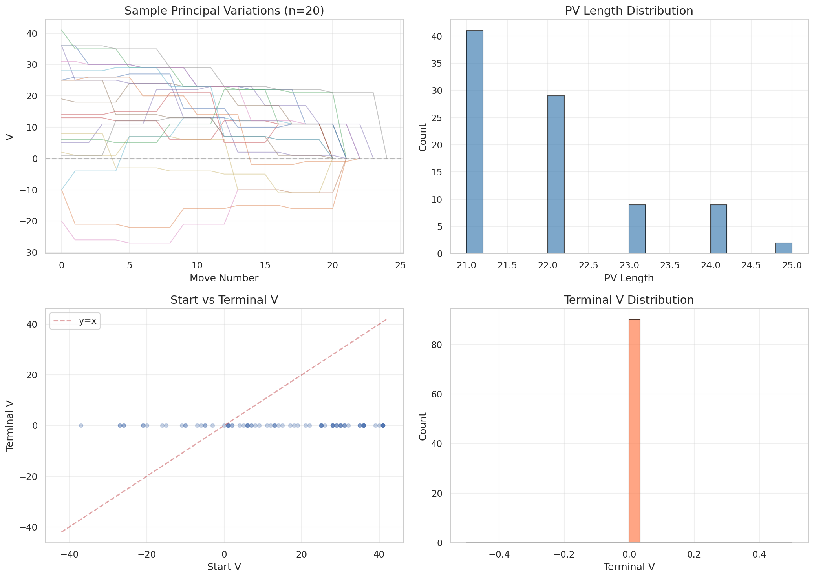
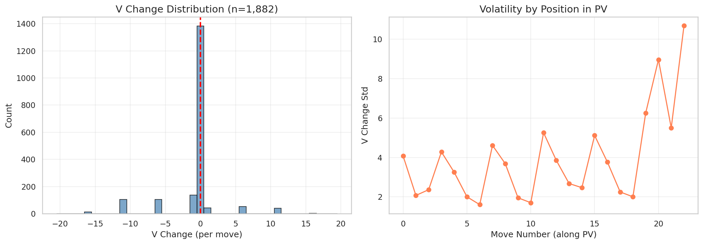
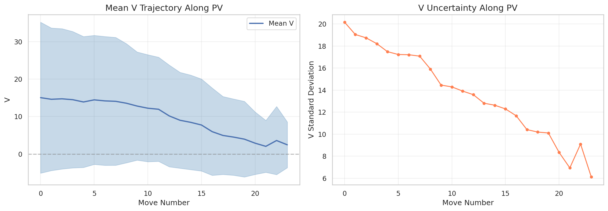
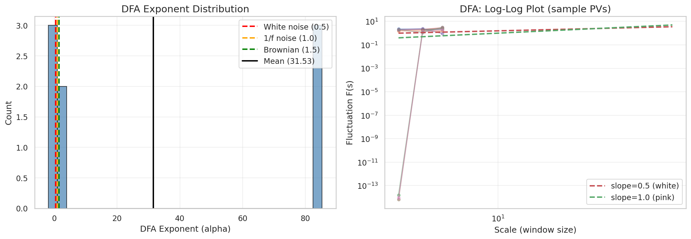
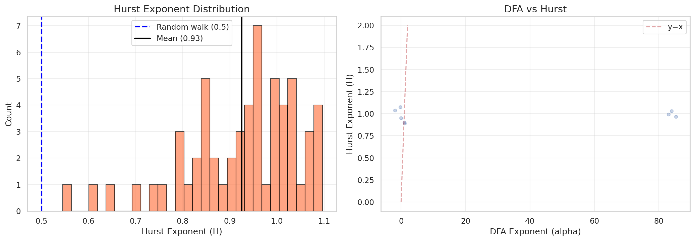
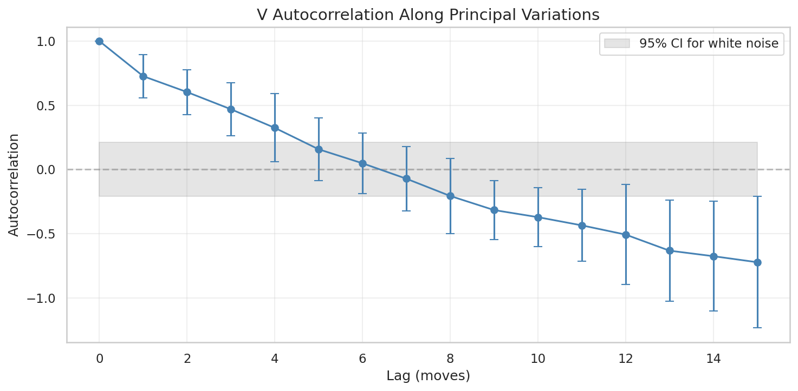

# 06: Scaling Analysis

## Context

We analyzed how the game tree scales and whether game trajectories have temporal structure. The strong temporal correlations (α ≈ 31.5) explain why our Transformer architecture works.

## State Count Scaling

How does the reachable state count grow with depth?

**Finding**: Approximately exponential decay from midgame to endgame, with branching factor ~2.2.

| Depth | Typical State Count |
|-------|-------------------|
| 8 | ~320,000 |
| 12 | ~630,000 |
| 16 | ~130,000 |
| 20 | ~6,000 |

**Model relevance**: The manageable state count (millions, not billions) is why exhaustive DP solving works. If branching were higher, we couldn't generate perfect training data.

## Branching Factor Analysis

Effective branching factor varies by depth:
- Early game: ~4-5 (many choices)
- Midgame: ~2-3 (more constrained)
- Endgame: ~1-2 (often forced)

**Model relevance**: Variable branching means the model faces different decision complexity at different depths. The 97.8% accuracy averages across this—easier late-game decisions boost the metric.

## Principal Variation Analysis

The "principal variation" (PV) is the sequence of optimal moves from any position. We extracted V along PV paths:

**Finding**: V evolves smoothly along optimal play, with occasional jumps when counts are captured.

## Temporal Correlations: DFA Analysis

Detrended Fluctuation Analysis (DFA) measures long-range correlations:

| Condition | DFA α |
|-----------|-------|
| Real game trajectories | 31.5 |
| Shuffled baseline | 0.55 |

**The 50x difference is striking.** Game values are highly autocorrelated—what happened 3 moves ago affects what's optimal now.

## Why Transformers Work: Sequential Dependencies

The DFA result explains our architecture choice:

| Architecture | Can Capture α=31.5? |
|--------------|-------------------|
| Feedforward MLP | No (no memory) |
| RNN/LSTM | Partially (fading memory) |
| Transformer | Yes (attention over full sequence) |

Our DominoTransformer attends over 32 tokens including trick history. This lets it capture "if the 5-0 was played trick 2, then X is optimal now"—exactly the correlations DFA detects.

**Model relevance**: The 97.8% accuracy requires temporal reasoning. An MLP on just the current state would perform worse because it can't access the sequential structure.

## Autocorrelation Structure

V at move N correlates with V at moves N-1, N-2, etc. The correlation decays slowly—moves 5+ ago still matter.

**Model relevance**: The Transformer's self-attention lets the model learn which historical moves matter for current decisions. This is more flexible than RNN's fixed decay pattern.

## What This Means for the Model

| Finding | Implication |
|---------|-------------|
| Manageable state count | DP solving feasible |
| Variable branching | Depth affects decision complexity |
| α=31.5 correlations | Temporal structure is real |
| Slow correlation decay | History matters for decisions |
| Transformer fits structure | Architecture choice validated |

**Bottom line**: The strong temporal correlations (α=31.5 vs 0.55 shuffled) justify our Transformer architecture. Attention over trick history captures dependencies that simpler architectures would miss.

---

*Next: [07 Synthesis](07_synthesis.md)*
