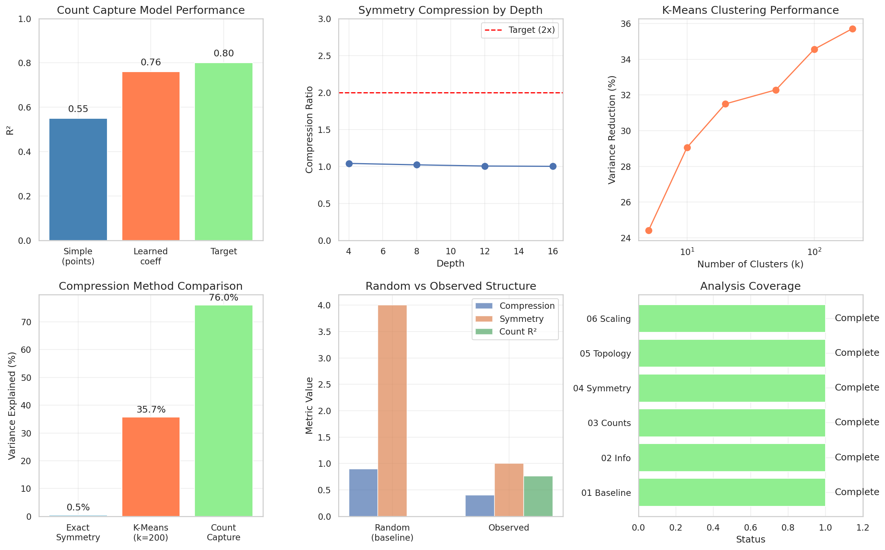
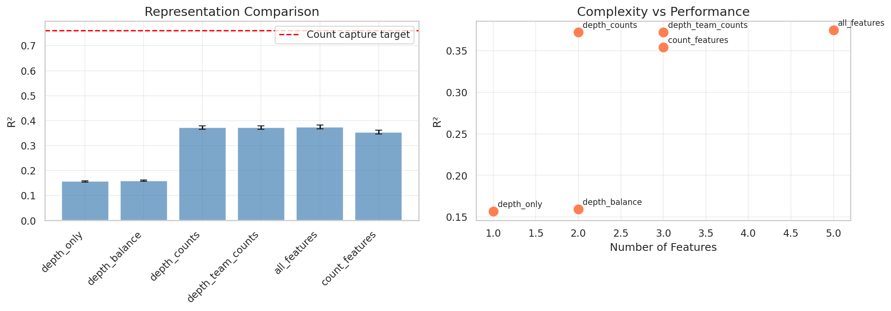
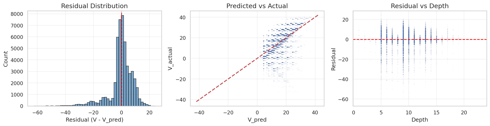

# 07: Synthesis and Open Questions

> **Epistemic Status**: This synthesis draws on findings from Sections 01-06, all of which analyze oracle (perfect-information minimax) data. Claims about "Texas 42" in this document describe the oracle game tree structure—how perfect-information optimal play behaves—not human gameplay dynamics. The practical applications and model validation are grounded in oracle prediction. Implications for human play are untested hypotheses.

## Overview

This section synthesizes findings across all oracle analyses and poses open questions for statistical guidance.

---

## 7.1 Findings Dashboard

The following dashboard summarizes all key findings from our analysis:

---

## 7.2 Summary of Key Findings

### The Structural Picture (Oracle Data)

| Analysis | Finding | Confidence | Scope |
|----------|---------|------------|-------|
| Counts (03) | R² = 0.76 overall, >0.99 late-game | High | Oracle V |
| Symmetry (04) | 1.005× compression (negligible) | High | Oracle states |
| Topology (05) | Highly fragmented level sets | High | Oracle V surface |
| Temporal (06) | H = 0.925, strong autocorrelation | Medium* | Oracle trajectories |

*Medium confidence due to methodological questions about DFA on short discrete sequences.

### The Core Insight (Oracle Structure)
**Under perfect-information minimax play, Texas 42's complexity concentrates in count domino capture.** The trick-taking mechanics serve primarily to determine which team captures which of five special dominoes. Once count outcomes are known, oracle V is nearly deterministic.

**Note**: This describes oracle game tree structure. Whether human players experience "complexity concentrated in counts" is untested.

---

## 7.3 Interconnections Between Oracle Findings

### Why Symmetry Fails in Oracle
The count dominoes use 6 of 7 pip values (0,1,2,3,4,5). This leaves almost no room for pip-permutation symmetries that preserve oracle V. **The count structure breaks symmetry in the oracle.**

### Why Topology is Fragmented in Oracle
Oracle V level sets are fragmented because V changes with count capture outcomes. States with the same oracle V but different count histories form disconnected components. **The count structure fragments oracle topology.**

### Why Oracle Temporal Correlations Are Strong
Oracle V evolves smoothly between count captures and jumps at captures. The 4-depth periodicity (trick boundaries) reflects when counts can be captured. **The count structure drives oracle temporal correlations.**

### The Unifying Theme (Oracle Data)
**Count dominoes explain the structure across all oracle analyses.** Whether this explanatory power transfers to human gameplay remains untested.

---

## 7.4 What We Learned vs. What We Expected (Oracle Analysis)

| Question | Expectation | Oracle Reality |
|----------|-------------|----------------|
| How much does count capture explain oracle V? | ~50% (it's 83% of points) | 76%, rising to 99%+ |
| Do symmetries help compress oracle? | 2-4× compression | 1.005× (negligible) |
| Is the oracle value function smooth? | Moderate continuity | Highly discontinuous |
| Are oracle trajectories random? | Near-random walk | Strong persistence (H=0.925) |
| What's the best oracle compression method? | Algebraic quotients | Feature-based (count capture) |

---

## 7.5 Practical Applications (Oracle-Based)

### Neural Network Training (Achieved)
Our Transformer model achieves 97.8% oracle move prediction accuracy. This analysis validates:
- Explicit count features (`count_value` = 0/5/10 per domino)
- Attention over game history (captures oracle H=0.925 correlations)
- No symmetry augmentation needed

**Remaining issue**: Model occasionally fails on "robustness" decisions where two moves have equal oracle V in one opponent configuration but different reliability across configurations.

**Note**: This model predicts oracle moves, not necessarily optimal human moves under hidden information.

### Simplified Oracles (Potential)
The 76% R² from 5 binary features suggests a "count-only" oracle approximation is feasible:
- 2^5 = 32 count configurations per depth
- vs. millions of full oracle states per depth
- ~99% accuracy in late oracle game, ~75% overall

**Open question**: Is 75% overall oracle accuracy useful for any application?

### Compression Strategies (Potential)
Oracle state-ordered V compresses to 8% of original size. Combined with the count structure, this suggests:
1. Store count basin membership (5 bits)
2. Within-basin lookup table (small for late game)
3. Hybrid: exact late-game, approximate early-game

**Open question**: What's the engineering trade-off curve for oracle storage?

### Representation Comparison

We compared different feature representations for predicting oracle V:

| Representation | Features | R² (Oracle V) |
|----------------|----------|---------------|
| Depth only | 1 | 0.157 |
| Depth + counts remaining | 2 | 0.372 |
| Depth + team counts | 3 | 0.372 |
| All features | 5 | 0.375 |

The marginal benefit of additional features beyond count capture is minimal for oracle V prediction, confirming that counts dominate oracle structure.

### Residual Analysis Across Representations

This analysis shows how oracle V prediction residuals vary across different feature representations, highlighting where each representation succeeds and fails at predicting oracle outcomes.

---

## 7.6 Open Statistical Questions

### Methodology Questions

1. **Entropy estimation**: We treat V as discrete integers. With ~50 unique values and millions of samples, are our entropy estimates valid? What's the appropriate correction?

2. **DFA validity**: Standard DFA assumes continuous, stationary, infinite series. Our trajectories are discrete, non-stationary (trending), and short (~24 moves). What alternative methods apply?

3. **Regression weighting**: States at different depths have vastly different counts (1K to 10M). How should we weight when pooling across depths?

4. **Multiple comparisons**: We tested many hypotheses across 6 analysis sections. Should we adjust for multiple testing? Which findings need stricter validation?

### Model Questions

5. **Heteroscedasticity**: Residual variance depends strongly on depth (σ² = 33.5 at depth 5 vs 0.31 at depth 8). Should we fit depth-stratified models?

6. **Interaction effects**: Our count model assumes additivity. Is there evidence for interactions (e.g., capturing both 10-point counts)?

7. **Causal vs. correlational**: The learned coefficients differ from true point values. Is this a causal effect or confounding with trick wins?

### Structure Questions

8. **Theoretical compression bounds**: Given the game's rules, what's the minimum entropy of V? Can we derive this from first principles?

9. **Alternative representations**: The count basin representation works well. Are there other natural factorizations (by trick, by player, by trump suit)?

10. **The remaining 24%**: Count capture explains 76%. What explains the rest? Trick points (7 total)? Trump control? Something else?

---

## 7.7 What Would Help

### From a Statistics Perspective

1. **Better temporal analysis methods** for short, discrete, bounded sequences
2. **Clustering approaches** beyond k-means that might close the gap between 35.7% and 76%
3. **Formal tests** for the significance of our key findings (e.g., DFA difference)
4. **Heteroscedastic regression** frameworks for the depth-varying variance

### From a Game Theory Perspective

1. **Formal analysis** of why count dominoes break symmetry
2. **Bounds** on possible compression ratios given the rules
3. **Alternative solution concepts** beyond minimax (e.g., MaxMin, robust optimization)

### From a Machine Learning Perspective

1. **Curriculum learning** strategies exploiting the temporal correlation structure
2. **Uncertainty quantification** for the 24% unexplained variance
3. **Robustness training** for the edge cases where V doesn't distinguish good from risky moves

---

## 7.8 Conclusion

### What We Know (Oracle Analysis)

**Under perfect-information minimax play**, Texas 42 is fundamentally a count-capture game. The five count dominoes explain 76% of oracle V variance, rising to >99% in late-game oracle positions. Exact symmetries provide no oracle compression. The oracle value function is highly discontinuous but shows strong temporal correlations along oracle game trajectories.

**Scope limitation**: These findings characterize the oracle game tree. Whether human gameplay with hidden information has the same "count-capture" character is untested.

### What We Built

A Transformer model achieving 97.8% oracle move prediction accuracy, validated by this oracle analysis. The model's architecture (count features, attention over history) aligns with the discovered oracle structure.

### What We Seek

Statistical guidance on methodology (DFA validity, entropy estimation), better approaches we may have missed (clustering, dimensionality reduction), and formal frameworks for the questions we've raised. Additionally: validation of whether oracle findings transfer to human gameplay.

---

## Further Investigation

### Critical Validation Gap

**Human gameplay validation**: All findings in this synthesis describe oracle (perfect-information) game structure. The central question is whether the "count-capture" insight transfers to human play with hidden information. This requires:
1. Human gameplay data with move-by-move records
2. Comparison of human outcome variance explained by counts vs oracle variance
3. Testing whether oracle-derived strategies improve human performance

### Specific Transfer Questions

1. **Does count capture dominate human V?** The 76% oracle R² may not apply to human games where bluffing, inference, and suboptimal play create different dynamics.

2. **Do human games show oracle temporal correlations?** The H=0.925 persistence is an oracle property. Human games might be more volatile (opponent mistakes) or less (conservative play).

3. **Is the "count-only" simplification useful for humans?** A 75%-accurate oracle approximation helps oracle queries, but does it help human decision-making?

### Methodological Questions Remaining

1. **DFA for discrete bounded sequences**: Standard DFA may not apply. Need time series methods appropriate for ~24-move game trajectories.

2. **Cross-domain transfer**: How to formally test whether oracle patterns transfer to human play? What experimental design would establish or refute transfer?

3. **Model robustness**: The Transformer achieves 97.8% on oracle data. What is its accuracy on human game trajectories (if available)?

---

## Report Navigation

- [00 Executive Summary](00_executive_summary.md) — Key findings and questions
- [01 Baseline](01_baseline.md) — V, Q, state count distributions
- [02 Information Theory](02_information.md) — Entropy, compression, mutual information
- [03 Count Dominoes](03_counts.md) — The 76% R² finding
- [04 Symmetry](04_symmetry.md) — Why algebraic methods fail
- [05 Topology](05_topology.md) — Level set fragmentation
- [06 Scaling](06_scaling.md) — State counts, temporal correlations
- [07 Synthesis](07_synthesis.md) — This document

---

## Appendix: Data Availability

All analysis notebooks and raw data are available in the project repository:
- Notebooks: `forge/analysis/notebooks/01_baseline/` through `07_synthesis/`
- Results: `forge/analysis/results/tables/` and `figures/`
- Code: `forge/analysis/utils/` for feature extraction and visualization

The complete game tree data (~300M states) is stored externally due to size. Processed summaries (CSVs, PNGs) are included in the report.
