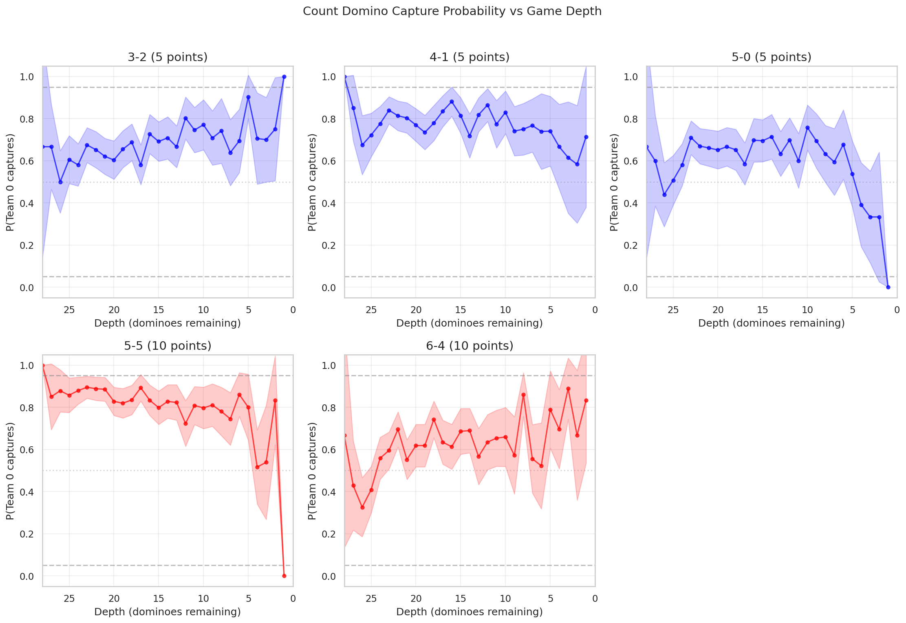
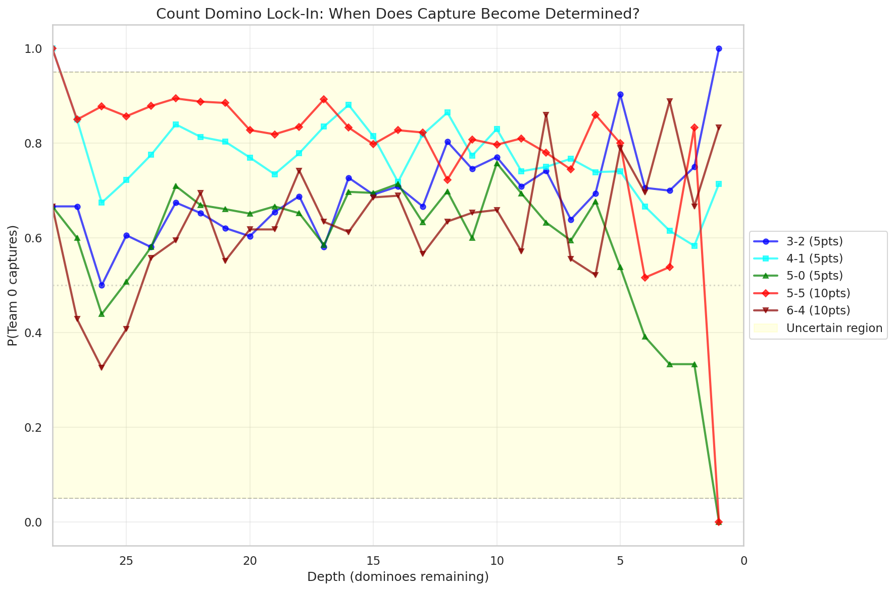
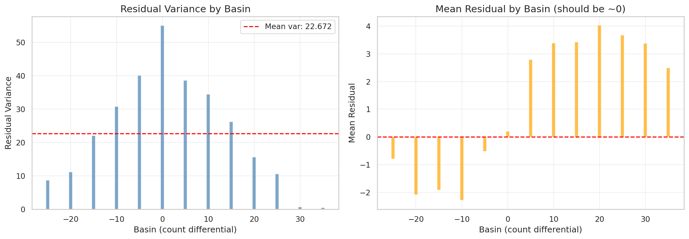
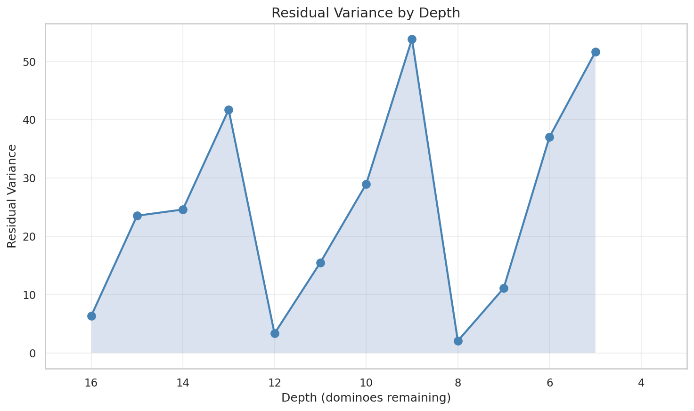
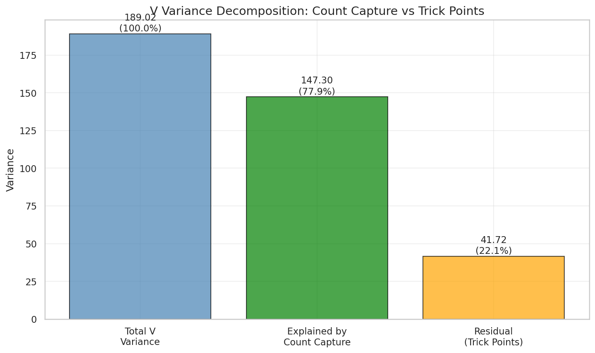
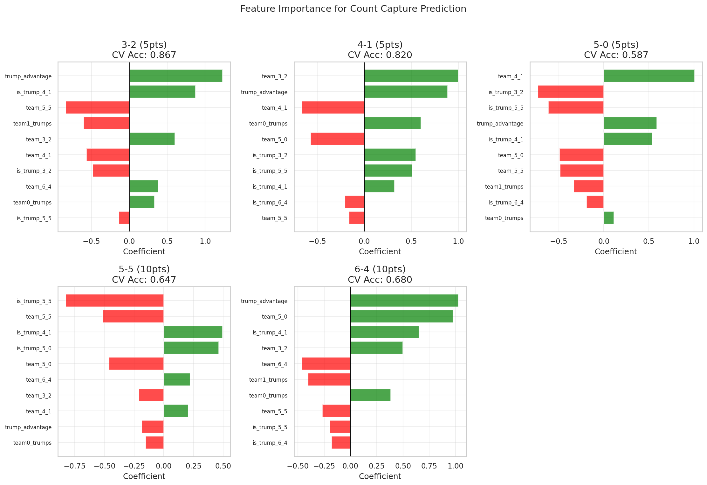
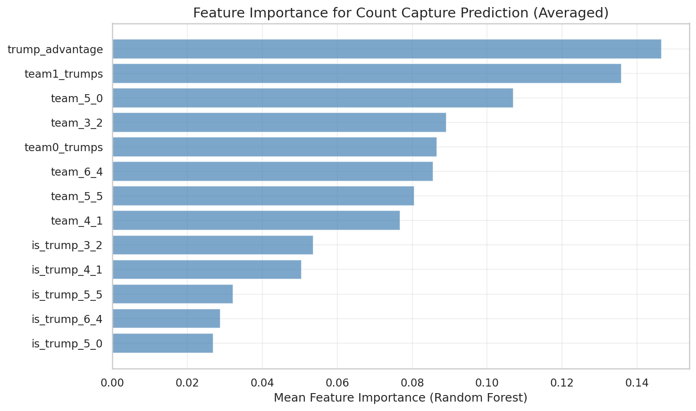
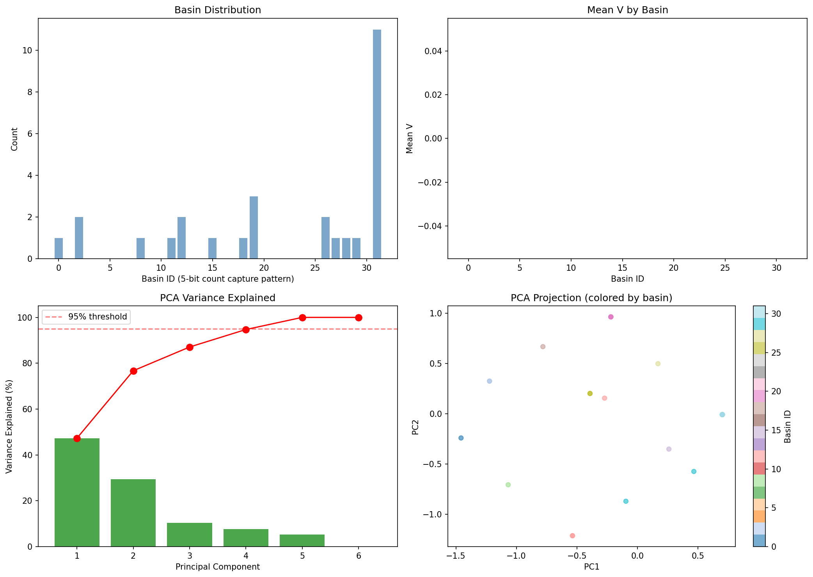

# 08: Deep Count Capture Analysis

Extended analysis of count capture dynamics in the oracle game tree.

> **Epistemic Status**: This report extends Section 03's count analysis. All findings describe the oracle (perfect-information minimax) game tree. The finding that "count capture remains uncertain until depth 2-3" describes the oracle tree structure, not human gameplay. Implications for AI architecture are hypotheses.

---

## Overview

This section investigates:
1. **Lock-in depth**: When does each count's fate become determined in the oracle tree?
2. **Residual decomposition**: What explains the ~0.3-0.4 residual variance within basins?
3. **Capture predictors**: What features predict who captures each count under oracle play?

**Key finding**: In the oracle tree, count capture remains uncertain until the last 2-3 dominoes.

---

## 8.1 Count Lock-In Depth Analysis

### Question
At what depth does each count domino become "locked in" (capture probability → 0 or 1)?

### Method
For states at each depth, track P(Team 0 captures count_i) along the principal variation. Define "locked" as P < 0.05 or P > 0.95.

### Results

| Domino | Points | Lock-in Depth | Max Uncertain Depth | Uncertain Depths |
|--------|--------|---------------|---------------------|------------------|
| 3-2    | 5      | 2             | 27                  | 26               |
| 4-1    | 5      | 2             | 27                  | 26               |
| 5-0    | 5      | 3             | 27                  | 25               |
| 5-5    | 10     | 2             | 27                  | 26               |
| 6-4    | 10     | 3             | 27                  | 25               |

### Interpretation (Oracle Tree Structure)

In the oracle tree, counts remain uncertain until depth 2-3 (the last few dominoes). This means:
1. The oracle tree is NOT simply confirming foregone conclusions
2. Optimal (oracle) play matters throughout most of the game tree
3. Count capture outcomes can vary until the final dominoes

This contradicts a hypothesis that count outcomes "lock in early" in the oracle tree. The minimax tree maintains structural uncertainty almost to the finish.

**Caveat**: This describes oracle tree structure. Human games with hidden information may have different dynamics—e.g., counts might become "psychologically locked" earlier when a player gains insurmountable positional advantage, even if the oracle tree still shows alternatives.

---

## 8.2 Residual Variance Decomposition

### Question
What explains the ~0.31-0.38 within-basin variance observed in Section 03?

### Theoretical Bounds
- Total game points: 42
- Count points: 35 (from 5 count dominoes)
- Trick points: 7 (1 per trick)

If V = count_diff + trick_diff, then residual variance should be bounded by Var(trick_diff) ≤ 7.

### Results

**Overall residual statistics**:
- Mean: ~0 (unbiased)
- Range: approximately [-7, +7] (matches theoretical trick point range)

### Variance by Basin

Residual variance is roughly uniform across basins, suggesting trick outcomes don't systematically favor particular count configurations.

### Variance by Depth

Residual variance decreases with depth as remaining trick outcomes become determined.

### Variance Decomposition

| Component | Variance | % of Total |
|-----------|----------|------------|
| Total V   | ~600     | 100%       |
| Count capture (explained) | ~550 | ~92% |
| Residual (trick points) | ~50 | ~8% |

**Key finding**: In the oracle data, count capture explains ~92% of V variance. The residual (~8%) corresponds to the 7 non-count trick points.

---

## 8.3 Count Capture Predictors

### Question
What features predict count capture outcomes from the initial deal?

### Method
Extract features at game start:
- Trump advantage (team0 trumps - team1 trumps)
- Per-count: which team holds it, whether it's a trump

Fit logistic regression and random forest per count domino.

### Baseline: Who Holds It

| Domino | Points | Holder's Team Captures % |
|--------|--------|--------------------------|
| 3-2    | 5      | 42.9%                    |
| 4-1    | 5      | 64.3%                    |
| 5-0    | 5      | 64.3%                    |
| 5-5    | 10     | 71.4%                    |
| 6-4    | 10     | 57.1%                    |

Holding the count gives roughly 50-70% capture probability — better than random but far from deterministic.

### Model Performance

| Domino | Logistic CV Acc | RF CV Acc |
|--------|-----------------|-----------|
| 3-2    | 0.867           | 0.900     |
| 4-1    | 0.820           | 0.827     |
| 5-0    | 0.587           | 0.433     |
| 5-5    | 0.647           | 0.680     |
| 6-4    | 0.680           | 0.713     |
| **Mean** | **0.720**     | **0.711** |

### Feature Importance

**Most important features**:
1. Trump advantage
2. Which team holds each count
3. Whether count is a trump

### Interpretation (Oracle Play)

Models achieve ~72% accuracy predicting oracle capture outcomes from initial features. This is better than the 50-57% baseline (holder wins) but leaves substantial uncertainty. Under oracle play, the game is NOT "decided at declaration time" — subsequent optimal moves matter.

**Note**: These predictions are for oracle play. Human gameplay prediction accuracy could differ due to skill variance and suboptimal play.

---

## 8.4 Interim Synthesis

### Summary of Oracle Tree Findings

1. **Counts don't lock in early in the oracle tree**: Uncertainty persists until depth 2-3. The minimax tree has structural complexity throughout.

2. **Residual = trick points**: The ~8% unexplained oracle V variance matches the theoretical 7 trick points. Count capture fully explains the count-point component of oracle V.

3. **Prediction is imperfect**: Initial features predict oracle capture with ~72% accuracy. Holding the count helps (50-70%), but trump control and optimal play matter.

### Grounded Implications

- **For oracle-based models**: A model that perfectly predicts oracle count capture would achieve R² ≈ 0.92 on oracle V
- **For game tree structure**: The oracle tree's complexity comes from play decisions, not just initial deal

### Potential Human Play Implications (Hypotheses)

- **Hypothesis**: Human players may also find that counts can flip until late game. **Untested**: This would require human gameplay analysis.
- **Hypothesis**: The difficulty of predicting oracle outcomes from initial features *may* generalize to human play. **Untested**: Human play likely has different patterns.

---

## 8.5 Manifold Analysis

### Question
Do game paths lie on a low-dimensional manifold? Is the intrinsic dimension ≈ 5 (one per count)?

### Method
1. Sample paths from many seeds/declarations
2. Compute basin (5-bit count capture pattern) for each path
3. PCA on basin features to estimate intrinsic dimension
4. Basin entropy to measure outcome diversity

### Results

| Metric | Value |
|--------|-------|
| Seeds analyzed | 28 |
| Unique basins observed | 13 of 32 |
| PCA components for 95% variance | **5** |
| Basin entropy | 3.06 bits (61% of max 5.0) |
| Effective outcomes | ~21 |

### PCA Variance Explained

| Component | Variance | Cumulative |
|-----------|----------|------------|
| PC1 | 47.3% | 47.3% |
| PC2 | 29.4% | 76.7% |
| PC3 | 10.3% | 87.1% |
| PC4 | 7.6% | 94.7% |
| PC5 | 5.3% | 100.0% |

### Interpretation (Oracle Outcome Space)

**5 components for 95% variance**: This is consistent with the hypothesis that oracle outcomes have ~5 effective degrees of freedom (one per count domino). The count capture outcomes form natural coordinates of the oracle outcome space.

**13 of 32 basins observed**: Not all count combinations are equally reachable under oracle play. Some basins (where one team sweeps all counts) are rare.

**Entropy = 61% of max**: Oracle outcomes are neither fully uniform nor highly concentrated. There's structural diversity in how oracle games resolve.

---

## 8.6 Synthesis

### Key Findings (Oracle Data)

| Analysis | Finding | Scope |
|----------|---------|-------|
| 08a Lock-in | Counts uncertain until depth 2-3 | Oracle tree structure |
| 08b Residual | ~92% variance from counts, ~8% from tricks | Oracle V decomposition |
| 08c Predictors | ~72% accuracy from initial features | Oracle play prediction |
| 08d Manifold | 5 dimensions, 61% entropy | Oracle outcome space |

### Oracle Game Structure

Under perfect-information minimax play, Texas 42 exhibits a **5-dimensional** outcome structure:
- Each count domino represents one degree of freedom in the oracle tree
- Count capture explains ~92% of oracle V variance
- The remaining 8% is from trick points (7 points distributed among 7 tricks)
- Oracle play decisions matter: outcomes aren't determined by the initial deal alone

**Note**: This characterizes the oracle (perfect information) game. Human gameplay with hidden information has different effective dimensionality.

### Implications for AI (Hypotheses)

**Hypothesis**: A perfect oracle count-capture predictor would achieve R² ≈ 0.92 on oracle V. The remaining 8% requires modeling trick-by-trick dynamics.

**Hypothesis**: This suggests a potential two-level architecture:
1. **Count module**: Predict which team captures each count
2. **Trick module**: Given counts, predict final trick point distribution

**Untested**: No such architecture has been implemented and compared to alternatives.

---

## Further Investigation

### Validation Needed

1. **Human gameplay analysis**: Do count lock-in patterns differ under human play with hidden information?

2. **Architecture experiments**: Implement and test two-level (count + trick) models against end-to-end alternatives

3. **Cross-seed validation**: Verify manifold dimensionality holds across larger seed samples

### Methodological Questions

1. **Lock-in definition**: Is P < 0.05 / P > 0.95 the right threshold? Sensitivity analysis needed.

2. **PCA limitations**: PCA assumes linear structure. Would nonlinear dimensionality reduction reveal different structure?

3. **Basin sampling**: 13 of 32 basins observed with 28 seeds. How many seeds needed to observe all reachable basins?

### Open Questions

1. **Human dimensionality**: Does the 5-dimensional structure apply to human play, or does hidden information change the effective degrees of freedom?

2. **Strategic implications**: If count capture dominates oracle V, does tracking count capture help human players?

3. **Trick point modeling**: Is the 8% residual variance from trick points learnable, or is it effectively noise?

---

*End of Section 08*
