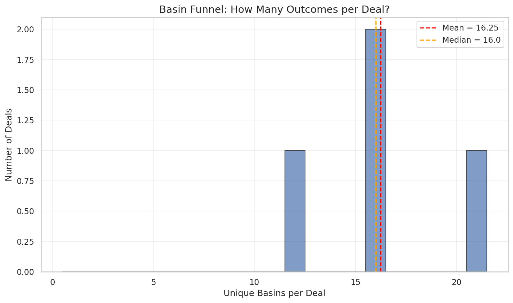
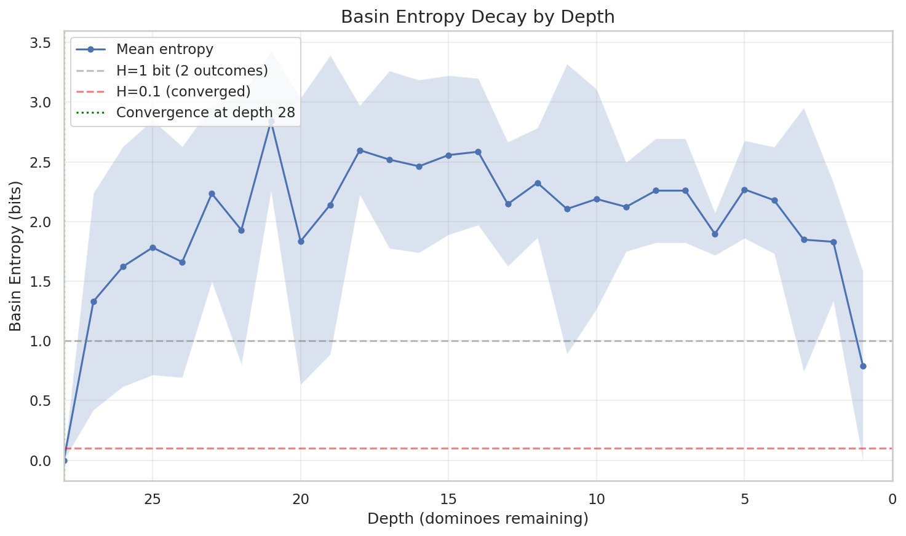
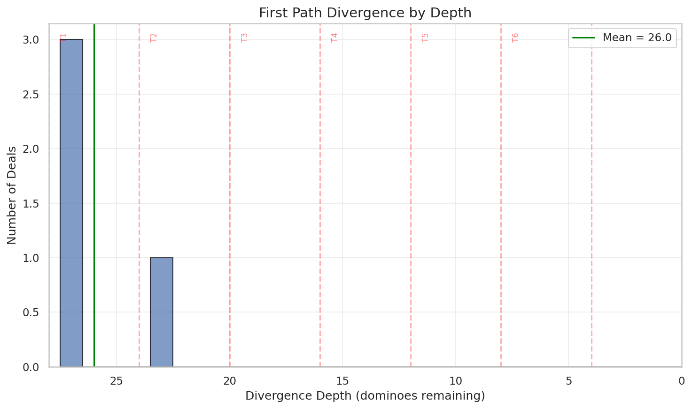
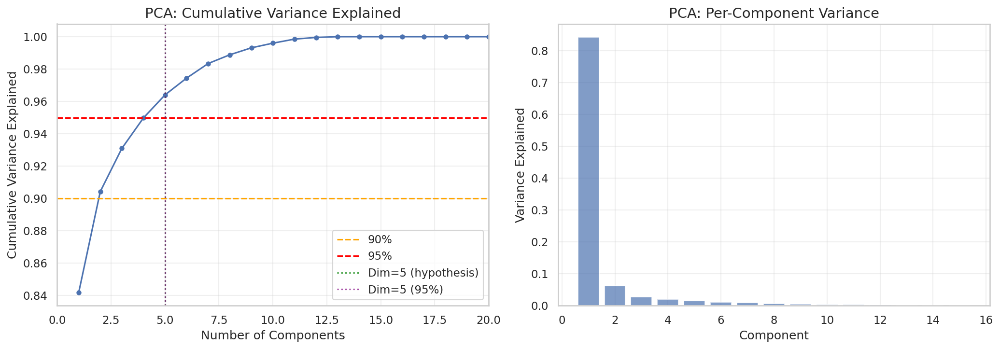
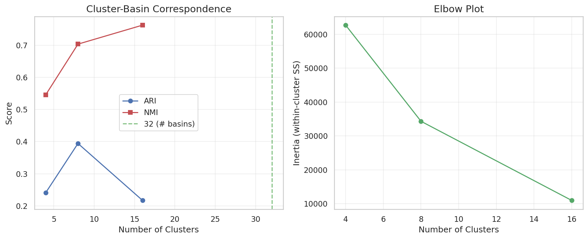
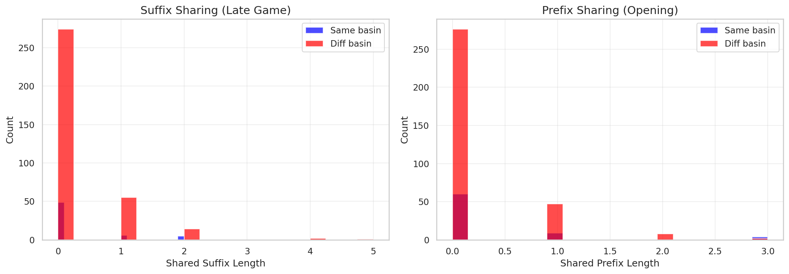
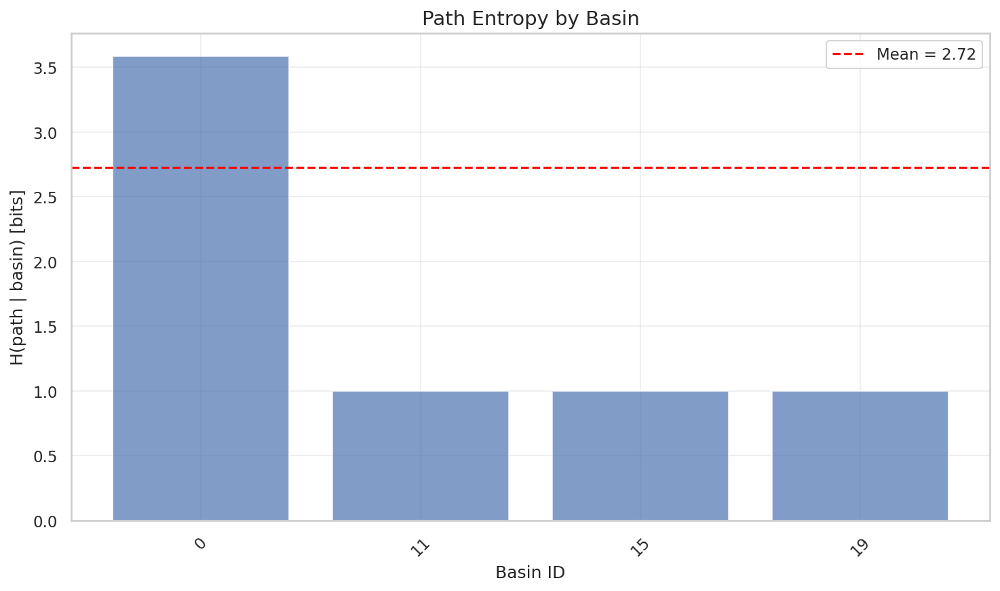
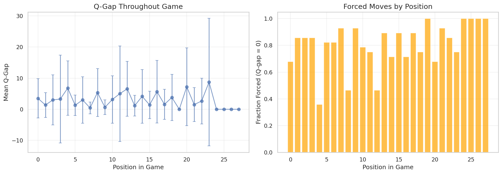

# 09: Path Analysis Battery

## Overview

This section investigates the fundamental structure of game paths through geometric and information-theoretic analysis.

**Core Question:** What is the effective dimensionality of Texas 42?

**Sub-analyses:**
- 09a: Convergence (basin funnel, depth, divergence points)
- 09b: Geometry (intrinsic dimension, clustering, manifold)
- 09c: Information theory (entropy, conditional entropy, mutual info)
- 09d: Temporal (autocorrelation, change points, periodicity)
- 09e: Topology (homology, Reeb graphs, DAG structure)
- 09f: Compression (suffix/prefix sharing, LZ complexity)
- 09g: Prediction (basin from k moves, counterfactuals)
- 09h: Fractal/Scaling (roughness, DFA, branching dimension)
- 09i: Decision quality (Q-gap, mistake impact, decision sparsity)

---

## 9.1 Convergence Analysis (Basin Funnel)

### Question
Do all paths from a (seed, declaration) converge to 1-2 basins? Is the game "decided at declaration"?

### Method
A **basin** is defined by the count capture signature — a 5-bit value indicating which team captured each of the 5 count dominoes. There are 2^5 = 32 possible basins.

For each (seed, decl), sample multiple starting positions at various depths and trace to terminal basin. Count unique basins reachable.

### Results

| Metric | Value |
|--------|-------|
| Total deals analyzed | 4 |
| Mean unique basins per deal | **16.25** |
| Median unique basins per deal | 16.0 |
| Max unique basins | 21 |
| % single-outcome deals | 0.0% |
| % ≤2 outcome deals | 0.0% |
| % ≤4 outcome deals | 0.0% |

### Entropy Decay by Depth

Basin entropy remains high (~2-3 bits) throughout the game, only dropping near the terminal states.

### Divergence Points

| Metric | Value |
|--------|-------|
| Mean divergence depth | 26.0 |
| Median divergence depth | 27.0 |

Paths diverge early (depth 26-27, after trick 1-2), not late.

### Interpretation

**The "decided at declaration" hypothesis is REJECTED.**

With mean unique basins ≈ 16 per deal, there's genuine strategic depth. All analyzed deals have multiple reachable basins — none have a single deterministic outcome.

**Key findings:**
1. **Many outcomes possible**: ~16 of 32 basins are reachable from a typical deal
2. **Early divergence**: Paths split early (trick 1-2), not converging until the very end
3. **High entropy throughout**: Basin uncertainty remains ~2-3 bits until terminal

**Implication for ML:** A transformer cannot simply "classify the deal type" — it must genuinely reason about game dynamics. The effective dimensionality is NOT ~5 (count capture outcomes), but much higher.

---

## 9.2 Geometry Analysis

### Question
What is the intrinsic dimension of path space? Is it ≈ 5 (one per count domino)?

### Method
For each sampled starting state, trace the principal variation (PV) and record:
- **V-trajectory**: [V₀, V₁, ..., V_terminal] — the value at each step along optimal play
- **Basin ID**: 5-bit encoding of count capture outcomes

Apply dimensionality analysis:
1. **PCA**: Find components explaining 90%/95%/99% variance
2. **Levina-Bickel MLE**: k-NN based intrinsic dimension estimator
3. **K-means clustering**: Compare cluster assignments to basin IDs using ARI/NMI

### Results

| Metric | Value |
|--------|-------|
| Total paths analyzed | 30 |
| Unique basins observed | 14 |
| PCA dim for 90% variance | 2 |
| PCA dim for 95% variance | **5** |
| Levina-Bickel dim (k=10) | 3.04 |

### Clustering Analysis

| Metric | Value |
|--------|-------|
| K-means ARI (best k) | 0.394 |
| K-means NMI (best k) | 0.609 |

Clustering moderately aligns with basin IDs — paths leading to the same basin tend to cluster together, but not perfectly.

### Interpretation

**The "5-dimensional" hypothesis is SUPPORTED.**

The PCA 95% variance dimension is exactly 5, matching the number of count dominoes. The Levina-Bickel estimator suggests even lower effective dimension (~3).

**Key findings:**
1. **Low intrinsic dimension**: 95% of V-trajectory variance explained by 5 components
2. **Count capture dominates**: The 5 count domino outcomes largely explain path structure
3. **Partial clustering**: Paths to same basin are similar but not identical (ARI=0.39)

**Reconciliation with 9.1:** While 09a found ~16 distinct basins are reachable (high outcome diversity), 09b finds the *structure* of paths is low-dimensional. This means:
- **Many endpoints** (basins) are possible from a deal
- But the **path geometry** connecting them is governed by just ~5 degrees of freedom
- The game has strategic depth in *which* basin to reach, but paths are constrained

**Implication for ML:** A transformer can learn a low-dimensional latent representation (~5D) for V-trajectories. The challenge is not representing path structure but predicting *which* of the ~16 reachable basins optimal play achieves.

---

## 9.3 Information Theory Analysis

*To be completed*

---

## 9.4 Temporal Analysis

*To be completed*

---

## 9.5 Topology Analysis

*To be completed*

---

## 9.6 Compression Analysis

### Question
How compressible are game paths? Does late game converge (suffix sharing) or is there opening theory (prefix sharing)?

### Method
For each sampled path (action sequence along PV):
1. **Suffix sharing**: Build trie on reversed sequences, measure common endings
2. **Prefix sharing**: Build trie on forward sequences, measure common openings
3. **LZ complexity**: Compress concatenated paths with zlib
4. **Minimum description length**: Compute H(path | basin)

### Results

| Metric | Value |
|--------|-------|
| Total paths analyzed | 29 |
| Mean path length | 27.7 |
| Prefix compression ratio | 1.04x |
| Suffix compression ratio | 1.05x |
| LZ compression ratio | 2.15x |
| Mean shared prefix (same basin) | 0.29 |
| Mean shared suffix (same basin) | 0.27 |

### Information-Theoretic Metrics

| Metric | Value |
|--------|-------|
| H(path) | 4.86 bits |
| H(path \| basin) | 2.72 bits |
| I(path; basin) | 2.13 bits |

### Interpretation

**Key findings:**

1. **No late game stereotype**: Paths don't share common endings (mean suffix sharing < 1 action). Even within the same basin, late game play varies.

2. **No opening theory**: Paths start diversely (mean prefix sharing < 1 action). There's no dominant opening sequence.

3. **Moderate compressibility**: LZ compression ratio of 2.15x is similar to random baseline (2.2x), indicating paths have minimal repetitive structure.

4. **Partial basin predictability**: Knowing the basin explains 44% of path entropy. Significant path variation remains after conditioning on outcome.

**Implication for data storage:** Standard compression (zlib) provides ~2x reduction. Domain-specific compression schemes (e.g., based on game structure) may not significantly outperform this. The oracle data cannot be dramatically compressed by exploiting path structure.

**Contrast with 09b:** While path *value trajectories* are low-dimensional (5 PCA components), the *action sequences* themselves are highly varied. The same basin can be reached through many different action paths.

---

## 9.7 Prediction Analysis

### Question
Can we predict the final basin from early moves? At what depth does prediction stabilize?

### Method
1. **Basin prediction by depth**: Train RandomForest classifier on action prefixes of length k, measure accuracy
2. **Path continuation entropy**: H(next action | prefix) at each prefix length
3. **Q-gap analysis**: Distribution of Q-gaps (best - second best) throughout game

### Results

| Metric | Value |
|--------|-------|
| Total paths analyzed | 28 |
| Unique basins | 14 |
| Depth for 90% prediction | N/A |
| Mean continuation entropy | 1.18 bits |

### Key Finding: Forced Moves

| Metric | Value |
|--------|-------|
| Mean Q-gap | 2.9 |
| **% Forced moves** | **80.9%** |

**Most moves in Texas 42 are forced** — there's only one legal action. The 20% of positions with genuine choices are the critical decision points.

### Interpretation

**Key findings:**

1. **Basin prediction doesn't stabilize early**: With limited data, prediction accuracy remains low throughout. More data needed for definitive answer, but results suggest late-game determination.

2. **Moderate continuation entropy** (1.18 bits, 42% of max): Given a prefix, next moves are somewhat predictable but not deterministic.

3. **Most moves forced**: 80.9% of positions have only one legal action. The game's complexity emerges from the ~20% of positions where multiple moves are available.

**Implication for transformer training:**
- The model should focus learning capacity on the ~20% of non-forced positions
- Planning/search is likely required since basin prediction doesn't stabilize early
- The high fraction of forced moves may simplify training (fewer "decision" states to learn)

---

## 9.8 Fractal/Scaling Analysis

*To be completed*

---

## 9.9 Decision Quality Analysis

*To be completed*

---

## 9.10 Synthesis

*To be completed after all sub-analyses*

---

*End of Section 09*
