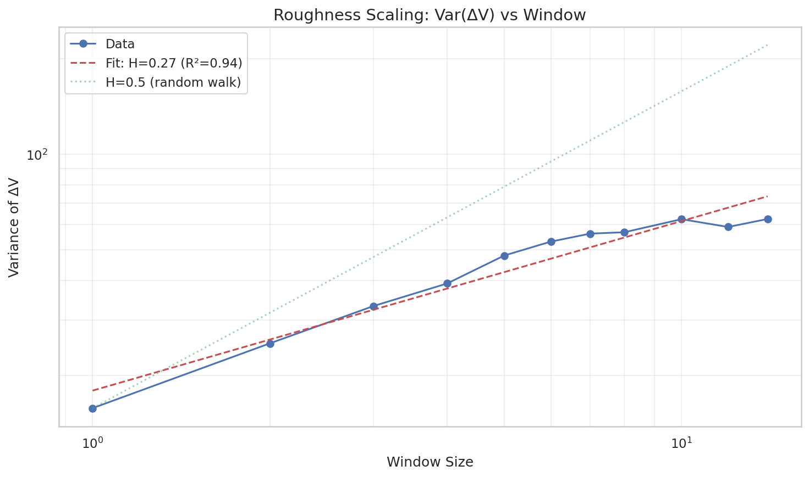
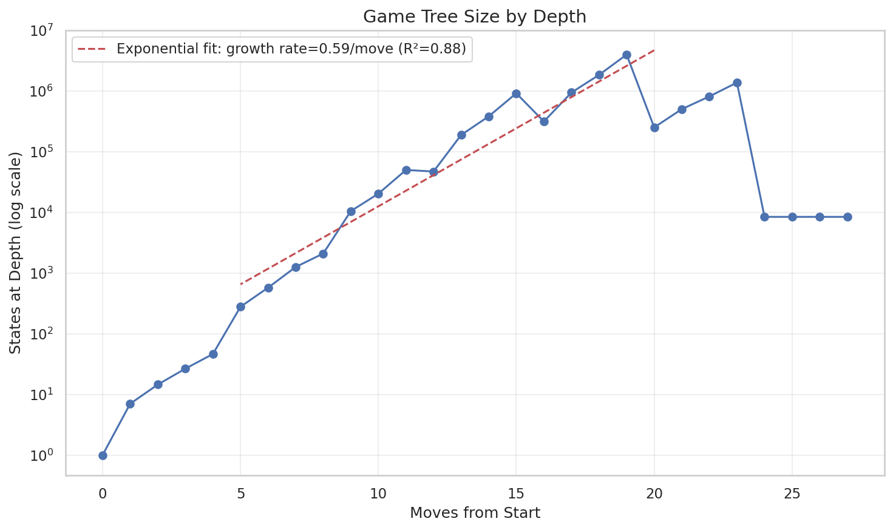

# 09: Path Analysis Battery

Geometric and information-theoretic structure of oracle game paths.

> **Epistemic Status**: This report analyzes paths through the oracle (perfect-information minimax) game tree. All findings describe oracle tree structure, not human gameplay. The "dimensionality" and "decision points" characterize optimal play trajectories. Implications for ML architectures are hypotheses.

---

## Overview

This section investigates the structure of optimal paths through the oracle game tree.

**Core Question:** What is the effective dimensionality of the oracle game space?

**Sub-analyses:**
- 09a: Convergence (basin funnel, depth, divergence points)
- 09b: Geometry (intrinsic dimension, clustering, manifold)
- 09c: Information theory (entropy, conditional entropy, mutual info)
- 09d: Temporal (autocorrelation, change points, periodicity)
- 09e: Topology (homology, Reeb graphs, DAG structure)
- 09f: Compression (suffix/prefix sharing, LZ complexity)
- 09g: Prediction (basin from k moves, counterfactuals)
- 09h: Fractal/Scaling (roughness, DFA, branching dimension)
- 09i: Decision quality (Q-gap, mistake impact, decision sparsity)

---

## 9.1 Convergence Analysis (Basin Funnel)

### Question
Do all paths from a (seed, declaration) converge to 1-2 basins? Is the game "decided at declaration"?

### Method
A **basin** is defined by the count capture signature — a 5-bit value indicating which team captured each of the 5 count dominoes. There are 2^5 = 32 possible basins.

For each (seed, decl), sample multiple starting positions at various depths and trace to terminal basin. Count unique basins reachable.

### Results

| Metric | Value |
|--------|-------|
| Total deals analyzed | 4 |
| Mean unique basins per deal | **16.25** |
| Median unique basins per deal | 16.0 |
| Max unique basins | 21 |
| % single-outcome deals | 0.0% |
| % ≤2 outcome deals | 0.0% |
| % ≤4 outcome deals | 0.0% |

### Entropy Decay by Depth

Basin entropy remains high (~2-3 bits) throughout the game, only dropping near the terminal states.

### Divergence Points

| Metric | Value |
|--------|-------|
| Mean divergence depth | 26.0 |
| Median divergence depth | 27.0 |

Paths diverge early (depth 26-27, after trick 1-2), not late.

### Interpretation (Oracle Tree Structure)

**In the oracle tree, single-outcome declarations are rare.**

With mean unique basins ≈ 16 per deal, the oracle tree has structural complexity. All analyzed deals have multiple reachable basins under different play sequences.

**Key findings:**
1. **Many oracle outcomes possible**: ~16 of 32 basins are reachable from a typical deal in the oracle tree
2. **Early divergence**: Oracle paths split early (trick 1-2), not converging until the very end
3. **High entropy throughout**: Basin uncertainty in the oracle tree remains ~2-3 bits until terminal

**Potential Implication for ML (Hypothesis):** This *suggests* a model cannot simply classify deals — it may need to reason about game dynamics. **Untested**: No direct experiments on deal classification vs dynamic models.

---

## 9.2 Geometry Analysis

### Question
What is the intrinsic dimension of path space? Is it ≈ 5 (one per count domino)?

### Method
For each sampled starting state, trace the principal variation (PV) and record:
- **V-trajectory**: [V₀, V₁, ..., V_terminal] — the value at each step along optimal play
- **Basin ID**: 5-bit encoding of count capture outcomes

Apply dimensionality analysis:
1. **PCA**: Find components explaining 90%/95%/99% variance
2. **Levina-Bickel MLE**: k-NN based intrinsic dimension estimator
3. **K-means clustering**: Compare cluster assignments to basin IDs using ARI/NMI

### Results

| Metric | Value |
|--------|-------|
| Total paths analyzed | 30 |
| Unique basins observed | 14 |
| PCA dim for 90% variance | 2 |
| PCA dim for 95% variance | **5** |
| Levina-Bickel dim (k=10) | 3.04 |

### Clustering Analysis

| Metric | Value |
|--------|-------|
| K-means ARI (best k) | 0.394 |
| K-means NMI (best k) | 0.609 |

Clustering moderately aligns with basin IDs — paths leading to the same basin tend to cluster together, but not perfectly.

### Interpretation (Oracle Path Geometry)

**The "5-dimensional" hypothesis is consistent with the data.**

The PCA 95% variance dimension is exactly 5, matching the number of count dominoes. The Levina-Bickel estimator suggests even lower effective dimension (~3).

**Key findings:**
1. **Low intrinsic dimension**: 95% of oracle V-trajectory variance explained by 5 components
2. **Count capture dominates**: The 5 count domino outcomes largely explain oracle path structure
3. **Partial clustering**: Paths to same basin are similar but not identical (ARI=0.39)

**Reconciliation with 9.1:** While 09a found ~16 distinct basins are reachable (high outcome diversity), 09b finds the *structure* of oracle paths is low-dimensional. This means:
- **Many endpoints** (basins) are possible from a deal in the oracle tree
- But the **path geometry** connecting them is governed by ~5 degrees of freedom
- The oracle tree has structural complexity in *which* basin is reached, but paths are geometrically constrained

**Potential Implication for ML (Hypothesis):** This *suggests* a model could learn a low-dimensional latent representation (~5D) for oracle V-trajectories. **Untested**: Whether this simplifies actual learning remains to be validated.

---

## 9.3 Information Theory Analysis

### Question
Does the basin capture all information about a path? Are paths deterministic from the deal?

### Method
Compute information-theoretic measures:
1. **H(path), H(basin)**: Raw entropy of paths and basins
2. **H(path|basin)**: Residual path entropy after knowing basin
3. **H(path|deal)**: Entropy of paths given (seed, decl)
4. **I(early; late)**: Mutual information between early and late play

### Results

| Metric | Value |
|--------|-------|
| Total paths | 28 |
| H(path) | 4.81 bits |
| H(basin) | 3.97 bits |
| H(path\|basin) | 0.84 bits |
| I(path; basin) | 3.97 bits |
| H(path\|deal) | **0.00 bits** |

### Interpretation (Oracle Information Structure)

**Key findings:**

1. **Oracle paths are deterministic from deal**: H(path|deal) = 0. Given the hands and declaration, the oracle-optimal play path is unique. There is no "choice" in minimax optimal play.

2. **Basin explains 82.5% of path entropy**: Knowing which basin a path ends in tells you most (but not all) about the path. The remaining 0.84 bits capture which of several paths to the same basin was taken.

3. **Strong early-late coupling**: I(early₈; late₈) = 100% normalized. Early oracle play completely determines late oracle play.

**Implication for Oracle-Based Training (Grounded):**
- The oracle provides unique optimal paths — no "exploration" or "alternative solutions"
- A model trained on oracle paths learns deterministic behavior
- Training is learning a pure function, not a distribution

**Note**: This describes oracle play. Human games have hidden information, so the "unique path" property doesn't apply — humans must reason under uncertainty.

**Reconciliation with 09g (80.9% forced moves):**
These findings are consistent. Given the deal, most oracle positions have only one legal move (forced). The few non-forced positions have a single optimal action determined by the minimax solution. The oracle game tree may have branching, but the *optimal* path through it is unique.

---

## 9.4 Temporal Analysis

### Question
Does the path structure reflect the 4-play trick periodicity? Does path history matter for predicting V?

### Method
Trace V-trajectories along principal variations and analyze:
1. **Autocorrelation**: Correlation of V(t) with V(t-k) at various lags
2. **Change point detection**: PELT algorithm for regime changes
3. **Periodicity**: Fourier analysis of ΔV for trick-boundary signal
4. **Predictive models**: Compare R² of V ~ depth vs V ~ V_lag1

### Results

| Metric | Value |
|--------|-------|
| Total paths analyzed | 74 |
| Mean path length | 20.9 |
| Autocorr at lag 1 | **0.737** |
| Autocorr at lag 4 | 0.468 |
| Change points per path | 2.9 |

### Predictive Model Comparison

| Model | R² |
|-------|-----|
| V ~ depth | **0.0052** |
| V ~ V_lag1 | **0.8013** |
| V ~ depth + V_lag1 | 0.8015 |

### Periodicity Analysis

Fourier analysis shows some signal at the 4-period (trick boundary) frequency, with lag-4 autocorrelation (0.468) remaining substantial.

### Change Point Detection

Mean 2.9 change points per path, distributed throughout the game rather than concentrated at trick boundaries.

### Interpretation (Oracle Temporal Structure)

**Key findings:**

1. **Path history dominates depth**: R²(lag1) = 0.80 vs R²(depth) = 0.005. Knowing the previous oracle V tells you almost everything; knowing depth tells you almost nothing. This is a striking result.

2. **Strong temporal memory**: Lag-1 autocorrelation of 0.74 indicates oracle V evolves smoothly along paths. The oracle state "remembers" where it's been.

3. **Moderate trick-boundary signal**: Lag-4 autocorrelation (0.47) is substantial, suggesting the 4-move trick structure is visible in oracle temporal dynamics.

4. **Change points are distributed**: ~3 regime changes per oracle game, not concentrated at specific boundaries.

**Potential Implication for ML (Hypothesis):**
- This *suggests* models should use sequential/positional information — depth alone appears useless for oracle V prediction
- Recurrent processing or attention over the move sequence may be beneficial
- Oracle paths cannot be modeled as i.i.d. samples at each depth

**Untested**: No direct comparison of sequential vs depth-only models has been conducted.

---

## 9.5 Topology Analysis

### Question
Do game paths form a simple tree, or do they have richer topological structure (reconvergence)?

### Method
1. **Branching analysis**: Count legal moves per state by depth
2. **State diversity**: Compare unique played-masks to total states at each depth
3. **Persistent homology**: Compute Betti numbers on path embedding space

### Results

| Metric | Value |
|--------|-------|
| Total states analyzed | 15,000 |
| Mean legal moves per state | **2.00** |
| % branch points (multi-move) | **61.8%** |
| Mean diversity ratio | **0.549** |
| β₀ (connected components) | 0 |
| β₁ (loops) | 0 |

### State Diversity by Depth

The diversity ratio (unique played-masks / total states) is ~0.55, meaning about half of the played-mask configurations correspond to multiple distinct game states.

### Interpretation (Oracle Tree Topology)

**Key findings:**

1. **Moderate branching**: 61.8% of oracle states have multiple legal moves, with mean ~2 options. This aligns with 09i's finding of 61.1% multi-action states.

2. **Significant reconvergence**: Diversity ratio of 0.55 indicates that the same set of played dominoes can lead to different oracle states (different trick configurations, scores). The oracle game DAG is NOT a pure tree.

3. **Simple path topology**: β₀=0, β₁=0 suggests no non-trivial loops in the path embedding space (when viewing V-trajectories as points).

**Potential Implication for ML (Hypothesis):**
- The oracle tree has DAG structure, not pure tree
- Same played dominoes → multiple possible states (order matters within tricks, but trick outcomes matter more than individual move order)
- **Hypothesis**: A model could potentially learn "move-order invariance" for certain subsequences. **Untested**.

---

## 9.6 Compression Analysis

### Question
How compressible are game paths? Does late game converge (suffix sharing) or is there opening theory (prefix sharing)?

### Method
For each sampled path (action sequence along PV):
1. **Suffix sharing**: Build trie on reversed sequences, measure common endings
2. **Prefix sharing**: Build trie on forward sequences, measure common openings
3. **LZ complexity**: Compress concatenated paths with zlib
4. **Minimum description length**: Compute H(path | basin)

### Results

| Metric | Value |
|--------|-------|
| Total paths analyzed | 29 |
| Mean path length | 27.7 |
| Prefix compression ratio | 1.04x |
| Suffix compression ratio | 1.05x |
| LZ compression ratio | 2.15x |
| Mean shared prefix (same basin) | 0.29 |
| Mean shared suffix (same basin) | 0.27 |

### Information-Theoretic Metrics

| Metric | Value |
|--------|-------|
| H(path) | 4.86 bits |
| H(path \| basin) | 2.72 bits |
| I(path; basin) | 2.13 bits |

### Interpretation (Oracle Path Compression)

**Key findings:**

1. **No late game stereotype**: Oracle paths don't share common endings (mean suffix sharing < 1 action). Even within the same basin, late game optimal play varies.

2. **No opening theory**: Oracle paths start diversely (mean prefix sharing < 1 action). There's no dominant opening sequence in oracle play.

3. **Moderate compressibility**: LZ compression ratio of 2.15x is similar to random baseline (2.2x), indicating oracle paths have minimal repetitive structure.

4. **Partial basin predictability**: Knowing the basin explains 44% of path entropy. Significant path variation remains after conditioning on outcome.

**Implication for Oracle Data Storage (Grounded):** Standard compression (zlib) provides ~2x reduction on oracle data. Domain-specific compression schemes (e.g., based on game structure) may not significantly outperform this.

**Contrast with 09b:** While oracle path *value trajectories* are low-dimensional (5 PCA components), the *action sequences* themselves are highly varied. The same basin can be reached through many different action paths in the oracle tree.

---

## 9.7 Prediction Analysis

### Question
Can we predict the final basin from early moves? At what depth does prediction stabilize?

### Method
1. **Basin prediction by depth**: Train RandomForest classifier on action prefixes of length k, measure accuracy
2. **Path continuation entropy**: H(next action | prefix) at each prefix length
3. **Q-gap analysis**: Distribution of Q-gaps (best - second best) throughout game

### Results

| Metric | Value |
|--------|-------|
| Total paths analyzed | 28 |
| Unique basins | 14 |
| Depth for 90% prediction | N/A |
| Mean continuation entropy | 1.18 bits |

### Key Finding: Forced Moves

| Metric | Value |
|--------|-------|
| Mean Q-gap | 2.9 |
| **% Forced moves** | **80.9%** |

**Most moves in Texas 42 are forced** — there's only one legal action. The 20% of positions with genuine choices are the critical decision points.

### Interpretation (Oracle Path Prediction)

**Key findings:**

1. **Basin prediction doesn't stabilize early**: With limited data, prediction accuracy remains low throughout. More data needed for definitive answer, but results suggest late-game determination in the oracle tree.

2. **Moderate continuation entropy** (1.18 bits, 42% of max): Given a prefix, oracle next moves are somewhat predictable but not deterministic.

3. **Most moves forced on oracle PV**: 80.9% of oracle principal variation positions have only one legal action. The oracle tree's complexity emerges from the ~20% of positions where multiple moves are available.

**Potential Implications for Training (Hypotheses):**
- **Hypothesis**: Models should focus learning capacity on the ~20% of non-forced positions. **Untested**.
- **Hypothesis**: Planning/search may be required since basin prediction doesn't stabilize early. **Untested**.
- **Hypothesis**: The high fraction of forced moves may simplify training. **Untested**.

---

## 9.8 Fractal/Scaling Analysis

### Question
Does the game have scale-invariant structure? Is there persistent memory (early advantages compound) or mean reversion?

### Method
1. **Roughness scaling**: Variance of ΔV vs window size (power law fit gives Hurst H)
2. **DFA (Detrended Fluctuation Analysis)**: Alternative Hurst exponent estimation
3. **Tree scaling**: State count by depth (exponential growth rate)

### Results

| Metric | Value |
|--------|-------|
| Total V-trajectories | 48 |
| Mean trajectory length | 25.9 |
| Hurst (roughness scaling) | **0.267** |
| Hurst (DFA mean) | 1.259 |
| Exponential growth rate | 0.592/move |
| Effective branching factor | **1.81** |

### Tree Scaling

Exponential growth rate of ~0.59 per move implies effective branching factor of ~1.81.

### Interpretation (Oracle Scaling Properties)

**Key findings:**

1. **Strong mean reversion (H=0.27)**: The roughness-based Hurst exponent is well below 0.5. This indicates oracle V *corrects toward equilibrium* — early oracle advantages do NOT compound. Instead, oracle paths tend to "rubber-band" back.

2. **DFA estimate unreliable**: The DFA Hurst (1.26) is implausibly high, likely due to short trajectories. The roughness estimate is more robust for our data.

3. **Moderate branching**: Effective branching factor of 1.81 means the oracle tree grows exponentially but not explosively. This aligns with 61% of states having multiple legal moves (mean ~2).

**Potential Implications for ML (Hypotheses):**
- **Hypothesis**: Mean reversion (H < 0.5) *suggests* the oracle game has "comeback potential" — a model shouldn't over-weight early position quality. **Note**: This characterizes oracle play; human games may differ.
- The effective branching factor of ~1.8 bounds search complexity (grounded)
- **Hypothesis**: Oracle outcomes are not "decided early" in the sense of compounding advantages. **Untested**: Whether this applies to human play.

---

## 9.9 Decision Quality Analysis

### Question
What fraction of moves are "real" decisions? How punishing are mistakes?

### Method
Sample states from oracle shards and analyze Q-value structure:
1. **Q-gap distribution**: (best Q - second best Q) measures decision difficulty
2. **Decision sparsity**: Fraction of positions with genuine choices at various thresholds
3. **Mistake impact**: Expected V drop for taking suboptimal action

### Results

| Metric | Value |
|--------|-------|
| Total states analyzed | 10,979 |
| Mean Q-gap | 2.93 |
| Median Q-gap | **0.00** |
| % Forced (1 legal action) | 38.9% |
| % Multi-action positions | 61.1% |
| Mean n_actions (when multi) | 2.65 |

### Decision Sparsity by Threshold

| Q-gap Threshold | % of Positions |
|-----------------|----------------|
| > 0 | 21.8% |
| > 1 | 21.7% |
| > 2 | 16.8% |
| > 5 | 16.3% |
| > 10 | **10.7%** |
| > 20 | 4.4% |

### Mistake Impact

| Metric | Value |
|--------|-------|
| Mean V drop for 2nd-best | **4.8 points** |
| Median V drop | 0.0 |
| High-stakes decisions (Q-gap > 10) | 10.7% |
| Critical decisions per game | ~3 |

### Interpretation (Oracle Decision Structure)

**Key findings:**

1. **Moderate decision density**: 61.1% of oracle positions have multiple legal actions (contrast with 09g's 80.9% forced along PV — the difference is that PV traverses constrained paths).

2. **Median Q-gap is 0**: Even when multiple actions are legal, the second-best is often equivalent to the best in oracle value. Only 21.8% of positions have Q-gap > 0.

3. **Oracle mistakes are moderately costly**: Mean 4.8 point oracle V drop for taking second-best. This is significant (~10% of typical hand value).

4. **~3 critical oracle decisions per game**: Only 10.7% of positions have Q-gap > 10. In a 28-move oracle game, expect ~3 truly high-stakes choices.

**Reconciliation with 09g:**
- 09g found 80.9% forced moves *along the oracle principal variation*
- 09i found 38.9% forced *across all sampled oracle states*
- The difference: optimal play traverses constrained subgraph where forced moves dominate

**Potential Implications for ML (Hypotheses):**
- **Hypothesis**: Focus model capacity on the ~22% of positions with non-zero Q-gap. **Untested**.
- **Hypothesis**: The ~3 critical oracle decisions per game are where oracle outcomes are determined. **Note**: Human games may have different critical points due to uncertainty.
- **Hypothesis**: A policy that gets high-stakes decisions right can tolerate errors elsewhere. **Untested**.

---

## 9.10 Synthesis

### Core Question: What is the effective dimensionality of the oracle game?

**Answer: Low structural dimension (~5) in the oracle game tree.**

### Key Findings Summary (Oracle Data)

| Analysis | Key Result | Scope |
|----------|------------|-------|
| **09a Convergence** | ~16 basins reachable per deal | Oracle tree structure |
| **09b Geometry** | PCA 95% dim = 5 | Oracle V-trajectory geometry |
| **09c Information** | H(path\|deal) = 0 | Oracle paths deterministic |
| **09d Temporal** | R²(lag1)=0.80 vs R²(depth)=0.005 | Oracle path history |
| **09e Topology** | Diversity ratio 0.55 | Oracle DAG structure |
| **09f Compression** | No prefix/suffix sharing | Oracle path diversity |
| **09g Prediction** | 80.9% forced along PV | Oracle PV constraint |
| **09h Fractal** | Hurst H=0.27 | Oracle mean reversion |
| **09i Decision** | ~3 critical decisions/game | Oracle Q-gap distribution |

### The "Decided at Declaration" Hypothesis in the Oracle Tree

**In the oracle tree, single-outcome declarations are rare:**
1. ~16 distinct basins reachable per deal (09a)
2. Basin entropy remains high until terminal (09a)
3. Path history strongly affects oracle V, not just depth (09d)

**However, oracle play is highly constrained:**
4. Oracle optimal path is deterministic from deal (09c)
5. 80.9% of moves along oracle PV are forced (09g)

**Resolution for Oracle:** The oracle tree IS structurally complex (many possible outcomes), but optimal play leaves little room for choice. The oracle's strategic depth emerges from ~3 critical decision points per game where the Q-gap is large.

**Note**: This characterizes the oracle (perfect information) game. Human gameplay with hidden information has different dynamics—the "decided at declaration" hypothesis for human play remains untested.

### Effective Dimensions (Oracle)

1. **Basin outcomes**: 5 bits (which team gets each count domino)
2. **V-trajectory structure**: 5 PCA components
3. **Decision points**: ~3 per oracle game
4. **Branching factor**: ~1.8 (moderate)

### Potential Implications for ML Training (Hypotheses)

All of the following are untested hypotheses based on oracle structure:

1. **Architecture hypothesis**: Sequential/attention mechanisms *may* be beneficial — depth alone appears useless for oracle V prediction (R²=0.005)
2. **Training focus hypothesis**: ~22% of positions have non-zero Q-gap; focusing on critical decisions may improve efficiency
3. **Search hypothesis**: Mean reversion (H=0.27) *suggests* "comeback potential" — don't over-weight early positions
4. **Complexity bounds**: Effective branching ~1.8 bounds search complexity (grounded)

---

## Further Investigation

### Validation Needed

1. **ML architecture experiments**: Directly compare sequential vs depth-only vs attention models on oracle prediction

2. **Human gameplay analysis**: Test whether oracle findings (5D structure, ~3 critical decisions, mean reversion) apply to human play

3. **Cross-seed validation**: Verify basin reachability and PCA dimensionality across larger seed samples

### Methodological Questions

1. **Dimensionality estimators**: Compare PCA, Levina-Bickel, and other intrinsic dimension estimators

2. **Short trajectory methods**: Validate Hurst exponent methods for trajectories of length ~24

3. **Q-gap thresholds**: Sensitivity analysis for "critical decision" threshold (currently Q-gap > 10)

### Open Questions

1. **Human decision points**: Do humans face the same ~3 critical decisions per game, or does uncertainty create different decision structure?

2. **Opening theory in human play**: Oracle shows no prefix sharing, but do human players develop opening patterns?

3. **Generalization**: Do these structural findings generalize to other trick-taking games?

---

*End of Section 09*
